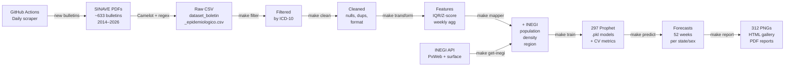

<p align="center">
  
</p>

<h1 align="center">EpiForecast-MX</h1>

<p align="center">
  <strong>Epidemiological Intelligence Platform for Neurological Disease Forecasting in Mexico</strong>
</p>

<p align="center">
  <em>Capstone Project · Master's in Applied Artificial Intelligence · Tecnológico de Monterrey</em><br>
  <em>In collaboration with the Instituto Mexicano del Seguro Social (IMSS)</em>
</p>

<p align="center">
  
  
  
  
  
  
  
  
</p>

---

## Project Description

**EpiForecast-MX** is a production-grade epidemiological intelligence platform developed in partnership with the **Instituto Mexicano del Seguro Social (IMSS)** to forecast the weekly incidence of three neurological and mental-health conditions across all 32 Mexican states:

| Condition | ICD-10 | Challenge |
|-----------|--------|-----------|
| Depression | F32 | High baseline, seasonal patterns, COVID disruption |
| Parkinson's disease | G20 | Low incidence, volatile per-state series |
| Alzheimer's disease | G30 | Aging-population trends, underreporting |

Predictions are generated at the **state level** (32 entities), **nationally**, and by **IMSS mental-health region**, disaggregated by sex (male, female, all), covering a **52-week forecast horizon**. Models are trained on 12+ years of historical data (2014–2026) from Mexico's national epidemiological surveillance system (SINAVE) and demographic indicators from INEGI.

### Why It Matters

- **Public health planning**: gives IMSS 52 weeks of forward visibility to allocate medical resources
- **Subnational granularity**: 297 state-level Prophet models expose geographic disparities invisible in national aggregates
- **Validated accuracy**: MASE < 1 across all three conditions — every model outperforms a seasonal naïve baseline
- **Automated pipeline**: end-to-end from PDF scraping to forecast charts, running on GitHub Actions

---

## Key Features

- **End-to-end ML pipeline** — ingestion → extraction → preprocessing → training → prediction → visualization
- **297 Prophet models** with temporal cross-validation (4 folds, recency-weighted), hyperparameter tuning, and log-rate normalization
- **Hybrid fallback** — 41 low-incidence state models automatically defer to regional models (v6), achieving 100% forecast coverage
- **Newton-optimizer protection** — 3-layer defense (sort + fold timeout + threshold skip) prevents runaway training (e.g., Chihuahua-Depression: 39 min → 4 min)
- **Anti-cheat CV** — all 297 final models are trained on the full series; CV uses temporal splits only for evaluation
- **312 forecast charts** — publication-quality PNGs per state/condition/sex + interactive HTML gallery
- **DVC + S3 versioning** — data, models, and forecasts tracked with reproducible lineage
- **Daily CI scraping** — GitHub Actions automatically downloads new SINAVE bulletins, extracts tables with Camelot, and merges them

---

## Project Structure

```
EpiForecast-MX/
│
├── src/epiforecast/               # Main Python package (src-layout)
│   ├── constants.py               #   ICD-10 codes, state list, rate constants
│   ├── data/
│   │   ├── extraction/            #   PDF → structured CSV (Camelot + regex)
│   │   │   ├── pdf_extractor.py   #     Table detection, parsing, reshaping
│   │   │   ├── extraction_pipeline.py  # Multi-PDF orchestration
│   │   │   └── merger.py          #     Incremental merge into master CSV
│   │   ├── ingestion/             #   INEGI demographic API client
│   │   │   ├── inegi.py           #     PxWeb + surface area download
│   │   │   ├── inegi_utils.py     #     Parsing, validation, CLI entry point
│   │   │   └── inegi_constants.py #     State abbreviations + mental-health regions
│   │   └── preprocessing/         #   Data cleaning & feature engineering
│   │       ├── cleaner.py         #     Column normalization, null handling
│   │       ├── filter.py          #     ICD-10 / condition filtering
│   │       ├── transformer.py     #     Time-series FE, weekly aggregation
│   │       └── imputation.py      #     IQR & Z-score outlier correction
│   ├── models/
│   │   ├── prophet/
│   │   │   ├── model.py           #     SerieTiempoProphet — CV + train + eval
│   │   │   ├── tuner.py           #     Grid search over HP combos
│   │   │   └── cross_validator.py #     Weighted CV folds (RMSE, MAE, MASE)
│   │   ├── factory.py             #     ModelFactory — extensible OCP
│   │   ├── prediction.py          #     Forecast loading + inverse transform
│   │   └── base.py                #     Abstract base class
│   ├── evaluation/
│   │   └── metrics.py             #   RMSE, MAE, MAPE, MASE calculations
│   ├── features/
│   │   └── demographic.py         #   INEGI merge — population, density, region
│   ├── visualization/
│   │   ├── forecast_chart.py      #     Prophet forecast PNG (IMSS branding)
│   │   ├── chart_annotations.py   #     Divisor, CV zone, metrics card helpers
│   │   ├── series_plots.py        #     Historical time-series plots
│   │   ├── eda_plots.py           #     EDA distributions and heatmaps
│   │   ├── inegi_plots.py         #     INEGI bar/boxplot charts
│   │   ├── inegi_tables.py        #     Rich console tabular EDA
│   │   ├── reporters.py           #     PDF report generator (reportlab)
│   │   ├── report_tables.py       #     PDF table helpers (IMSS style)
│   │   └── base.py                #     GraficosHelper ABC + IMSS styling
│   ├── pipelines/
│   │   └── base.py                #     AbstractPipeline interface
│   └── utils/
│       ├── config.py              #     OmegaConf YAML loader + Loguru setup
│       ├── paths.py               #     Path utilities (ensure_dir, file_exists)
│       └── dataframe_helpers.py   #     IQR/Z-score statistics (OperacionesDatos)
│
├── config/                        # All YAML configuration (no hardcoded values)
│   ├── base.yaml                  #   Entry point — imports all sub-configs
│   ├── data/params.yaml           #   Paths, disease filter, modeling flags
│   ├── models/modelado.yaml       #   Prophet HP grids, CV, COVID period
│   ├── features/FE.yaml           #   Outlier config, region mappings
│   ├── visualization/reportes.yaml#   IMSS color palette, matplotlib rcParams
│   └── infrastructure/logging.yaml#   Loguru dual-sink (console + rotating file)
│
├── scripts/                       # CLI entry points (one per Makefile target)
│   ├── train.py / predict.py      #   make train / make predict
│   ├── filter.py / clean.py       #   make filter / make clean
│   ├── transform.py               #   make transform (feature engineering)
│   ├── report.py / bitacora.py    #   make report / make bitacora
│   └── ci_process.py              #   CI/CD: extract + merge new bulletins
│
├── tests/                         # 536 tests, 84% coverage
│   ├── unit/                      #   Pure unit tests (no I/O, mocked config)
│   └── integration/               #   End-to-end pipeline smoke tests
│
├── notebooks/                     # Exploratory analysis (read-only reference)
├── data/                          # DVC-managed data artifacts
│   ├── raw_PDFs/                  #   ~633 SINAVE bulletins 2014–2026 (~1 GB)
│   ├── raw/ interim/ processed/   #   Pipeline stages
│   └── utils/inegi.csv            #   Demographic lookup table
├── models/                        # 297 Prophet .pkl + CSV sidecars (DVC → S3)
├── reports/                       # Generated outputs (Cookiecutter v2 standard)
│   ├── forecasts/                 #   312 forecast PNGs + HTML gallery + reports
│   ├── figures/                   #   EDA figures (21+ charts)
│   └── dashboards/                #   Tableau .twb files
├── Makefile                       # All workflow targets
└── pyproject.toml                 # Dependencies, Ruff, Mypy, Pytest config
```

---

## Installation

### Prerequisites

- Python 3.12
- [Ghostscript](https://www.ghostscript.com/) (required by Camelot for PDF parsing)
- AWS credentials configured (for DVC + S3 data pull)
- Git + [DVC](https://dvc.org/)

### Quick Start (macOS)

```bash
# 1. Clone the repository
git clone https://github.com/IntegradorIMSS2026Team01/EpiForecast-MX.git
cd EpiForecast-MX

# 2. Install system dependencies and create virtualenv
make setup           # macOS: brew install ghostscript + pip install -e ".[dev]"
# OR for Linux/WSL:
make setup-linux

# 3. Activate the virtual environment
source .venv/bin/activate

# 4. Pull data, models, and forecasts from S3 via DVC
make data-pull

# 5. Verify everything works
make quality         # lint + typecheck + 536 tests
```

### Manual Installation

```bash
# Create virtual environment
python3.12 -m venv .venv
source .venv/bin/activate

# Install package with development dependencies
pip install -e ".[dev]"

# Install Ghostscript (macOS)
brew install ghostscript

# Pull versioned data
dvc pull
```

---

## Usage

### Full Pipeline (end-to-end)

```bash
# Run the complete preprocessing pipeline (must run sequentially, not with -j)
make preprocess
# Internally runs: reset_logs → get-dataset → filter → clean → transform → get-inegi → mapper

# Train all 297 Prophet models with cross-validation (~45 min, uses n_jobs=-2)
make train

# Generate 52-week forecasts + 312 PNG charts
make predict

# Build interactive HTML report
make report

# Open the forecast gallery in your browser
open forecast/index.html
```

### Step-by-Step Usage

```bash
# 1. Filter by condition (configure config/data/params.yaml: padecimiento.tipo)
make filter          # options: General | Depresión | Parkinson | Alzheimer

# 2. Clean dataset (nulls, duplicates, column normalization)
make clean

# 3. Feature engineering (outlier correction IQR/Z-score, weekly aggregation)
make transform

# 4. Merge INEGI demographic data (population, density, mental-health region)
make get-inegi
make mapper

# 5. Train Prophet models per state × condition × sex
make train

# 6. Generate predictions (desnormalize log-rate → case counts)
make predict

# 7. Build PDF/HTML reports
make report
make bitacora
```

### Configuration

All behavior is controlled through YAML files in `config/` — no hardcoded values in source code:

```yaml
# config/data/params.yaml — key settings
padecimiento:
  tipo: "General"              # General | Depresión | Parkinson | Alzheimer
  modelado_estados: true       # true = state models, false = regional models
  modelado_hibrido: true       # v6: auto-fallback to regional for low-incidence states
  modelado_sexo: "todos"       # hombres | mujeres | todos
  entrena_modelo: true         # train final model on full series after CV
```

```yaml
# config/models/modelado.yaml — Prophet hyperparameter grids (tuned across 297 models v5)
param_grid_prophet:
  alzheimer:
    seasonality_mode: [multiplicative]
    changepoint_prior_scale: [0.01, 0.03]
    seasonality_prior_scale: [0.05, 0.1, 0.5]
  depresion:
    seasonality_mode: [additive, multiplicative]
    changepoint_prior_scale: [0.01, 0.03, 0.05]
    seasonality_prior_scale: [0.025, 0.05, 0.1, 0.5]
  parkinson:
    seasonality_mode: [multiplicative, additive]
    changepoint_prior_scale: [0.03, 0.04, 0.05]
    seasonality_prior_scale: [0.1, 0.5, 1.0]
```

### Data Versioning

```bash
make data-pull       # Download data/models/forecasts from S3
make data-push       # Upload new data to S3
make models-push     # Version trained models with DVC + push to S3
make forecast-push   # Version forecasts with DVC + push to S3
make data-status     # Check sync status
```

---

## Data Pipeline



### Transform Chain

The target variable goes through three sequential transformations before Prophet sees it:

1. **Population normalization** — `y_rate = (cases / population) × 100,000`
2. **Log transform** — `y = log(1 + y_rate)` — stabilizes variance in volatile series
3. **Prophet trains on `y`** (log-rate space)

On prediction, both transforms are inverted: `exp(ŷ) − 1` → denormalize to case counts using state population.

---

## Model Architecture

### Prophet with Temporal Cross-Validation

Each of the 297 models follows this training protocol:

```
Series: 12+ years of weekly incidence (log-rate, per 100K inhabitants)
CV: 4 temporal folds, weights [0.50, 0.75, 1.00, 1.25] (recent folds weighted higher)
HP grid: up to 24 combinations per condition (see config/models/modelado.yaml)
Selection: weighted-average RMSE across 4 folds
Final model: trained on full series (no holdout leakage)
```

### Newton-Optimizer Protection

Prophet falls back to Newton optimizer (~500× slower) when L-BFGS fails to converge. Three layers prevent this:

| Layer | Mechanism |
|-------|-----------|
| 1. Sort | Test high `changepoint_prior_scale` combos first (faster convergence) |
| 2. Timeout | Each fold capped at 35 s via `ThreadPoolExecutor` |
| 3. Threshold | If combo with `cp=X` times out, skip all combos with `cp < X` |

**Result**: Chihuahua-Depression training time 39 min (v4) → 4 min (v5).

### Hybrid Fallback (v6)

States with average incidence below 0.5 cases/week are classified as `confianza: "insuficiente"`. With `modelado_hibrido: true`, these 41 state-models are replaced at prediction time by the corresponding INEGI mental-health **regional model** (4 regions: Metropolitana alta, Urbana media, Rural/dispersa, Sur-Sureste vulnerable), while still using individual state population for denormalization.

---

## Evaluation Metrics

### Cross-Validation Results (v6 — 2026-02-21)

| Condition | Models | Insufficient | Fallback | Median RMSE | Median MASE | Training Time |
|-----------|--------|-------------|----------|-------------|-------------|---------------|
| Alzheimer | 99 | 36 | 36 | 0.027 | 0.74 | ~2 min |
| Depression | 99 | 0 | 0 | 0.183 | 0.80 | ~28 min |
| Parkinson | 99 | 5 | 5 | 0.057 | 0.75 | ~14 min |

**MASE < 1 across all three conditions** — every model outperforms a seasonal naïve baseline (lag-52 weeks).

### Metric Definitions

| Metric | Formula | Interpretation |
|--------|---------|----------------|
| **RMSE** | `√mean((ŷ−y)²)` | Error in log-rate units; lower is better |
| **MAE** | `mean(|ŷ−y|)` | Robust average absolute error |
| **MAPE** | `mean(|ŷ−y|/y) × 100` | Percentage error (undefined near 0) |
| **MASE** | `MAE_model / MAE_naïve(lag-52)` | < 1 = beats seasonal naïve; scale-free |

### SageMaker Benchmark (v5-full, 2026-02-22)

Comparison of 6 algorithms across 258 series on AWS SageMaker (1,548 trials, ~$9.80 USD):

| Model | Wins | Win % | Median MASE |
|-------|------|--------|-------------|
| **Prophet** | 61 | **23.6%** | **0.745** |
| DeepAR | 50 | 19.4% | 0.748 |
| LightGBM+LSTM | 49 | 19.0% | 0.748 |
| TFT | 37 | 14.3% | 0.773 |
| Ridge | 33 | 12.8% | 0.822 |
| XGBoost | 28 | 10.9% | 0.832 |

Prophet wins most individual series and has the best median MASE. Deep learning collectively wins 53% of series, but the operational simplicity, interpretability, and retraining speed of Prophet make it the production choice for IMSS.

---

## Development

### Code Quality

```bash
make quality         # lint + typecheck + tests (full gate)
make lint            # ruff check + ruff format --check
make format          # ruff format (auto-fix)
make typecheck       # mypy (strict on epiforecast.*)
make test            # pytest with coverage report
make test-fast       # pytest -x (stop on first failure)
```

Current quality metrics:

| Check | Status |
|-------|--------|
| Ruff linting | ✅ 0 errors |
| Ruff formatting | ✅ 0 diffs |
| Mypy (52 files) | ✅ 0 errors |
| Tests | ✅ 536 passing |
| Coverage | ✅ 84% (1871/2232 statements) |
| Compliance | 147/153 (96%) — Grade A+ |

### Pre-commit Hooks

```bash
make hooks           # install pre-commit hooks
# Hooks run automatically on git commit:
#   - ruff check --fix
#   - ruff format
#   - mypy
#   - trailing-whitespace / end-of-file-fixer
```

### Compliance Check

The project uses a custom Cookiecutter DS v2 compliance checker:

```bash
python scripts/compliance_check.py
# Checks: project structure (32), SOLID (71), CleanCode (6),
#         MLOps (19), Testing (9), Tooling (6), Imports (2), Documentation (2)
```

### Adding a New Model

1. Subclass `AbstractModel` in `src/epiforecast/models/base.py`
2. Register it in `ModelFactory` (`src/epiforecast/models/factory.py`)
3. Add HP grid to `config/models/modelado.yaml`
4. Tests go in `tests/unit/models/`

---

## CI/CD

Two GitHub Actions workflows run automatically:

| Workflow | Trigger | What it does |
|----------|---------|-------------|
| `scrape_boletines.yml` | Daily 2 PM CDMX | Selenium downloads new SINAVE PDFs → DVC push → SNS notification |
| `process_boletines.yml` | Post-scrape | Camelot extraction → incremental merge → DVC push → SNS |
| `ci.yml` | Pull request / push | `make quality` (lint + typecheck + 536 tests) |

The full data lineage is reproducible: `dvc repro` rebuilds all pipeline stages from raw PDFs to forecast CSVs.

---

## Team

| Name | Role | Organization |
|------|------|-------------|
| **Javier Augusto Rebull Saucedo** | Lead Developer | Sr. Associate, Santander |
| **Juan Carlos Pérez Nava** | ML Engineer | IT Professional, IMSS |
| **Luis Gerardo Sánchez Salazar** | Data Engineer | Sr. Controls Engineer, Tesla |

**Academic Advisor**: Dr. Grettel Barceló Alonso — Tecnológico de Monterrey

**IMSS Collaborators**: Dr. Ruth Pérez · Dr. Lina Díaz Castro

---

## License

This project is released under the [MIT License](LICENSE).

---

## Acknowledgments

- **IMSS** — for data access, domain expertise, and real-world deployment context
- **Tecnológico de Monterrey** — MNA (Master in Applied Artificial Intelligence) program and capstone framework
- **SINAVE / DGAE** — for the epidemiological surveillance bulletins (2014–2026)
- **INEGI** — for demographic data via PxWeb API
- **Meta / Facebook** — for the [Prophet](https://github.com/facebook/prophet) forecasting library
- **AWS** — S3 storage and SageMaker benchmarking infrastructure
