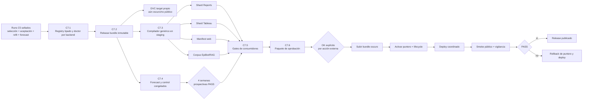

# C7 — Plan operativo de publicación de Obesidad

> **Estado:** plan validado; C7.1 tiene un WIP local con las Acciones **1–5 de 8 CERRADAS**.
> La auditoría independiente R13 revalidó el microcierre R11 y la reparación de la suite legacy:
> 259 pruebas focales, `make test-fast` con 1,610, lint, typecheck y ambos doctors verdes. No queda
> un fallo funcional abierto en esas acciones. La siguiente ejecución es la Acción 6, limitada a
> limpieza y trazabilidad de tests; después siguen el gate completo (7) y el commit aislado (8).
> No commitear ni avanzar a C7.2 hasta cerrar todas las acciones de las secciones 15 y 16.
>
> **Alcance:** publicar únicamente Obesidad E66. Anorexia F50 permanece
> `lifecycle=configured`, `channels: []`, `gallery_enabled: false` y oculta durante toda C7.
>
> **Límite de autoridad:** este documento no autoriza `dvc add`, `dvc push`, `git push`, merge,
> deploy, regeneración de Tableau, escritura en rutas canónicas ni el cambio
> `trained → published`. Cada acción externa se aprueba por separado después del gate de
> preparación.

C7 reemplaza únicamente la sección de publicación de
`docs/PLAN_BRUTAL_OBESIDAD_N_PLUS_1.md`. No reabre C1–C6, no retunea modelos y no modifica
`rolling_cv_v1`.

---

## 1. Resultado buscado

Publicar el forecast congelado de Obesidad como un release inmutable, restaurable y consumido por
puentes genéricos, sin alterar los artefactos de Depresión, Parkinson, Alzheimer o Dengue.

La publicación inicial tendrá estas decisiones cerradas:

| decisión | contrato C7 |
| --- | --- |
| Padecimiento | solo `obesidad` |
| Canales públicos iniciales | `web`, `epibot`, `reports`, `tableau` |
| Canales diferidos | `weekly_validation`, `prospective_validation` |
| Galería | desactivada en el primer release |
| Intervalos | `point-only`, declarado en datos, reportes y UI |
| Sede de modelos | bundle inmutable propio bajo DVC; no `models/` legacy ni `runs/` completo |
| Gate prospectivo | 4 semanas epidemiológicas consecutivas, sin retuning |
| Activación | lifecycle + puntero de release público; ambos deben coincidir |
| Rollback | restaurar puntero y versiones públicas anteriores; no borrar el bundle |

No se publicará como “preliminar” para saltarse el gate prospectivo. Una excepción requeriría una
decisión formal distinta y una modificación explícita de este plan.

---

## 2. Punto de partida verificado

Estado local al redactar:

| componente | estado |
| --- | --- |
| Backend | `feat/registry-padecimientos-obesidad` @ `b981b6e5` |
| Remoto backend | `origin/feat/registry-padecimientos-obesidad` @ `029fe666` |
| Frontend | `main` @ `179bbe36`, sin cambios trackeados |
| Obesidad | `trained`, NO-GO, invisible para `published_only` |
| F50 | `configured`, NO-GO, sin canales |
| Publicados | Depresión, Parkinson, Alzheimer y Dengue |
| Respaldo C5–C6 | `029fe666`, local + S3, SHA256 concordante |
| C7.0 | residuos pre-C3 fuera del dataset canónico; guard en `b981b6e5` |

Cadena estadística canónica:

| fase | run canónico |
| --- | --- |
| Dataset | `obesidad_1502d1a25b48` |
| Tuning Prophet | `obesidad_tune_smoke_3398a12d14c8` |
| Benchmark | `obesidad_benchmark_full_bbe604256cca` |
| Selección | `obesidad_select_bbe604256cca_fe51b3f6a20e` |
| Aceptación 2025 | `obesidad_benchmark_test_7f582a3a4ed7_82370419efd4` |
| Refit final | `obesidad_refit_final_91590fa7452f_ff249060018a` |
| Forecast | `obesidad_forecast_h52_ff249060018a_92d446b6df8f` |

Invariantes ya aprobados:

- 64 modelos base, 653 observaciones por serie y `train_end=2026-W26`;
- 111 productos: 64 bases + 47 derivados por suma exacta;
- 3,328 predicciones base y 5,772 filas totales para 2026-W27…2027-W26;
- cero duplicados, negativos, NaN o infinitos;
- `general = hombres + mujeres`;
- región = suma de sus estados;
- nacional = suma de los 32 estados;
- aceptación 2025 positiva en bases, 111 productos y nacional General;
- forecast point-only: límites inferior y superior nulos por contrato;
- legacy neuro + Dengue byte-idéntico después de C5;
- F50 demostró N+1 sin modificar Python genérico.

---

## 3. Correcciones de la auditoría a la versión anterior

### A1 — El doctor no falla: da un falso verde

La versión anterior decía que `doctor --artifacts` fallaba porque no existían modelos legacy de
Obesidad. La comprobación real es:

```text
.venv/bin/python -m scripts.doctor_padecimiento Obesidad --artifacts
✅ Obesidad: completo (config+artefactos).
```

Ese resultado es incorrecto semánticamente. El doctor actual solo comprueba que existan
`models/<engine>/Obesidad/` para los cuatro `training_engines` legacy. Esos directorios existen y
contienen artefactos preliminares anteriores al carril nuevo:

| directorio legacy | archivos observados |
| --- | ---: |
| `models/prophet/Obesidad/` | 223 |
| `models/deepar/Obesidad/` | 121 |
| `models/ensemble/Obesidad/` | 223 |
| `models/stacking/Obesidad/` | 223 |

Esos archivos no son los 64 modelos finales de C5 y no pueden autorizar publicación. C7 debe
eliminar el falso verde mediante identidad y digests, no mediante existencia de directorios.

### A2 — La identidad de modelos ya existe; falta una sede distribuible

Los 64 modelos finales sí tienen identidad: seis `model_index.json`, 64 envelopes, 64 estados,
digests, transformaciones, `SeriesKey`, ventana de entrenamiento y lineage. El problema real es que
viven en `runs/`, ruta gitignored y fuera de DVC.

El release no debe rediseñar esos artefactos. Debe empaquetar exactamente los artefactos sellados
en una unidad inmutable y distribuible.

### A3 — No hay un puente genérico de publicación

Los consumidores actuales leen artefactos legacy y contienen supuestos de tres padecimientos
neurológicos más Dengue. El forecast del runner no se debe insertar en
`all_forecast_<engine>.csv`: Obesidad es un portafolio por SeriesKey, no la salida de un solo motor.

C7 necesita un compilador de release que genere shards y manifests por padecimiento. Los
consumidores podrán adaptar esos shards sin reinterpretar nombres de archivo ni mezclar el
portafolio con agregados por motor.

### A4 — El flip de lifecycle no es un rollback completo

Un `git revert` del lifecycle recupera la invisibilidad lógica, pero no revierte por sí solo DVC,
S3, un deploy de Netlify, archivos del EpiBot ni una extracción de Tableau. El rollback real debe
restaurar el puntero de release y las versiones públicas anteriores.

### A5 — `channels` mezcla superficies y procesos

`weekly_validation` y `prospective_validation` no son superficies equivalentes a web o Reports.
Para el primer release de Obesidad no se declararán como canales públicos. El gate prospectivo se
ejecuta antes de publicar, pero eso no lo convierte automáticamente en un canal habilitado.

---

## 4. Arquitectura objetivo



Fuentes de verdad, sin duplicar decisiones:

| dato | autoridad |
| --- | --- |
| Identidad, lifecycle y canales permitidos | registry tipado |
| Candidatos y folds de evaluación | `rolling_cv_v1` intacta |
| Selección por SeriesKey | `final_selection.csv` sellado |
| Modelos finales | `model_index.json` + envelopes + estados |
| Forecast publicable | `forecast.csv` sellado |
| Contenido del release | `release_manifest.v1` |
| Release visible | puntero público versionado |

---

## 5. C7.1 — Hacer verdadera la identidad del registry y del doctor

### Objetivo

Distinguir explícitamente tres backends de artefactos:

- `legacy_models`: usa `models/<engine>/<artifact_key>/` para los cuatro padecimientos actuales;
- `runner_runs`: valida refit y forecast sellados bajo un `runs_root`; es válido para `trained`,
  nunca para `published`;
- `runner_release`: usa un `release_manifest.v1` restaurable desde DVC; es obligatorio para
  `published`.

No cambiar simplemente `training_engines` de Obesidad a seis strings. Ese campo gobierna el carril
legacy, mientras que los candidatos del runner ya viven en `rolling_cv_v1` y los motores realmente
seleccionados viven en `final_selection.csv`.

### Cambios de contrato

Añadir al schema tipado del registry una fuente de artefactos namespaced. El nombre final puede
ajustarse al estilo del módulo, pero debe representar como mínimo:

```yaml
artifact_source:
  backend: runner_runs
  refit_run_id: obesidad_refit_final_91590fa7452f_ff249060018a
  forecast_run_id: obesidad_forecast_h52_ff249060018a_92d446b6df8f
  policy_digest: dd6d4a0274a6f8bb0f51d27628294b7db694b792966abaa92528dc2765020b2a
  final_selection_digest: 91590fa7452fa75581df18d6e892ac7053727ab368d38d298a26931fe6e89bab
```

Después de C7.2, el candidato cambia a:

```yaml
artifact_source:
  backend: runner_release
  release_id: obesidad_release_<digest12>
```

`runner_runs` es admisible solo para `trained`. Para `published`, `backend=runner_release` y un
`release_id` no vacío son obligatorios.

Reglas:

1. `legacy_models` conserva el comportamiento actual para los cuatro publicados.
2. `runner_runs` y `runner_release` nunca autorizan desde `models/<engine>/Obesidad/`.
3. Para Obesidad, `training_engines`/`eligible_engines` legacy dejan de fingir que el carril nuevo
   entrenó DeepAR, Ensemble o Stacking. El runner continúa leyendo candidatos desde la política.
4. Para `runner_runs`, el doctor valida schema, padecimiento, run IDs, status, digests, 64
   SeriesKeys únicas, `final_refit=true`, `train_end`, engines realmente presentes y forecast
   64+47.
5. Para `runner_release`, el doctor valida lo anterior desde el bundle restaurado y contrasta
   `release_manifest.v1` y `SHA256SUMS.txt`.
6. Una carpeta existente sin envelope/digest correcto es un error.
7. Un artefacto preliminar legacy nunca satisface `runner_runs` ni `runner_release`.
8. F50 continúa sin source publicable y no gana canales.

### Gate C7.1

- doctor verde para Obesidad por los runs sellados, no por las carpetas legacy;
- alterar un digest, run ID, disease ID, `SeriesKey` o estado hace fallar el doctor;
- retirar un estado hace fallar el doctor;
- los cuatro publicados siguen validando con `legacy_models`;
- Obesidad permanece `trained`;
- `published_members()` sigue devolviendo exactamente cuatro padecimientos;
- ninguna salida material cambia;
- suites focalizadas, lint, typecheck y fast verdes.

### Commit propuesto

`C7.1 registry artifact backend + doctor identity-aware`

---

## 6. C7.2 — Construir un release bundle inmutable y versionarlo

### Decisión

Usar un target DVC nuevo y dedicado:

```text
artifacts/releases/obesidad/<release_id>/
```

No modificar `models.dvc`, no copiar a los directorios legacy y no versionar todo `runs/`.

`release_id` debe derivarse de los digests de los insumos inmutables, no de una fecha elegida a
mano. Formato sugerido:

```text
obesidad_release_<digest12>
```

### Contenido mínimo

```text
artifacts/releases/obesidad/<release_id>/
├── release_manifest.json
├── SHA256SUMS.txt
├── policy/
│   └── rolling_cv_v1.yaml
├── selection/
│   ├── final_selection.csv
│   └── acceptance.json
├── refit/
│   ├── run_manifest.json
│   ├── refit_summary.json
│   └── models/
│       └── <6 engines: índices + 64 envelopes + 64 estados>
└── forecast/
    ├── run_manifest.json
    ├── forecast_base.csv
    ├── forecast.csv
    ├── model_inventory.csv
    └── lineage.json
```

`release_manifest.v1` debe declarar:

- schema y `release_id`;
- `disease_id=obesidad`;
- code commit;
- dataset, policy, selection, acceptance, refit y forecast IDs/digests;
- conteos 64/47/111 y 3,328/5,772;
- origen 2026-W26 y horizonte 2026-W27…2027-W26;
- `interval_method=none` y `uncertainty_available=false`;
- listado de cada archivo con tamaño, SHA256 y schema;
- canales candidatos, todavía no activos;
- lifecycle requerido para activación;
- fecha de construcción como metadata no identitaria.

### Construcción

Crear un comando genérico de promoción desde runs sellados. Debe:

1. cargar y verificar todos los manifests antes de copiar;
2. rechazar runs fallidos, padecimiento distinto o lineage inconsistente;
3. copiar desde temporales y validar el bundle completo;
4. calcular `release_id` solo con contenido determinista;
5. ser idempotente: mismos insumos producen mismo `release_id` y mismos bytes;
6. rechazar un destino existente con contenido distinto;
7. no leer nombres de archivos para inferir identidad;
8. no tocar rutas canónicas ni públicas.

### Gate C7.2

- restauración desde clon/entorno limpio usando únicamente Git + target DVC;
- los 64 modelos cargan y producen el mismo forecast numérico;
- `forecast.csv` y los artefactos deterministas conservan los digests esperados;
- 6 índices + 64 envelopes + 64 estados presentes y verificados;
- cero referencias necesarias a rutas absolutas del equipo;
- `models.dvc`, forecasts legacy y Tableau legacy intactos;
- `dvc status` del nuevo target coherente y diff limitado al bundle/puntero nuevo;
- todavía no hay `dvc push`.

### Autorización

Construir el bundle local y crear su puntero DVC requieren OK de implementación de C7.2.
`dvc push` requiere otro OK posterior.

### Commit propuesto

`C7.2 immutable runner release bundle + dedicated DVC target`

---

## 7. C7.3 — Compilador genérico y puentes en modo sombra

### Objetivo

Transformar `release_manifest.v1` y `forecast.csv` en artefactos de consumo sin editar manualmente
listas de padecimientos y sin publicar antes del lifecycle.

El compilador tendrá dos modos:

- `candidate`: escribe solo bajo un output root temporal/staging explícito;
- `public`: solo acepta un padecimiento `published` cuyo release coincida con el puntero activo.

No puede escribir directamente en producción desde el modo `candidate`.

### Contrato común de salida

Cada fila conserva:

- `release_id`;
- `disease_id`;
- `SeriesKey` completa;
- periodo MMWR y `ds`;
- `yhat_cases`;
- motor seleccionado para bases;
- `derived=true/false`;
- lineage;
- `interval_method=none`;
- límites nulos;
- etiqueta visible “Pronóstico puntual; sin intervalo de incertidumbre”.

Los 47 productos derivados se atribuyen al portafolio, no a un motor ficticio.

### Puentes de la primera publicación

| canal | salida candidate | gate funcional |
| --- | --- | --- |
| Reports | shard/report de Obesidad separado | 111 productos, lineage visible, point-only |
| Tableau | shard de Obesidad con schema documentado | relaciones y conteos exactos, sin tocar el workbook canónico |
| Web | manifest/JSON generado | filtros y series desde datos, sin lista manual de Obesidad |
| EpiBot | sección de knowledge + zoom + corpus RAG | respuestas y gráficos de Obesidad desde el release |

Reglas:

1. No añadir Obesidad a `all_forecast_prophet.csv`, `all_forecast_deepar.csv`,
   `all_forecast_ensemble.csv` o `all_forecast_stacking.csv`.
2. No añadir Obesidad a `tabla_333_modelos_produccion.xlsx`.
3. No recrear `produccion_obesidad.csv` con el selector legacy.
4. No usar `stem.split("_")` para recuperar identidad.
5. No hardcodear `if disease == "obesidad"` en compiladores o consumidores.
6. El registry/manifest gobierna color, etiqueta, CIE, canales y capacidades.
7. Un disease `trained` puede compilarse a staging, pero nunca aparecer en outputs públicos.
8. F50 debe ser una prueba negativa explícita.
9. El frontend debe soportar límites nulos sin dibujar cero, área falsa ni error.
10. EpiBot/RAG no debe afirmar que existen intervalos ni confundir 64 modelos con 111 productos.

### Gate C7.3

- dos compilaciones candidate producen bytes/digests deterministas;
- todos los valores de los cuatro puentes cuadran con el forecast sellado;
- Obesidad continúa ausente de los outputs públicos mientras esté `trained`;
- F50 continúa ausente de candidate/public salvo prueba explícita de rechazo;
- los artefactos públicos vigentes de los cuatro padecimientos no cambian;
- las suites del backend y frontend quedan verdes;
- el índice RAG se regenera desde el corpus nuevo y verifica que no exista drift;
- nada se despliega.

### Commits propuestos

Separar backend y frontend:

1. `C7.3a generic publication compiler + candidate shards`
2. `C7.3b frontend manifest consumer + point-only UI`
3. `C7.3c EpiBot corpus/RAG generated from release manifest`

---

## 8. C7.4 — Gate prospectivo congelado

### Regla

Antes de ver resultados prospectivos, congelar:

- el forecast candidato vigente, originado en 2026-W26;
- un forecast control `seasonal_naive_lag52` con el mismo origen, horizonte, dataset y SeriesKeys;
- los digests de ambos;
- la regla de aceptación.

No retunear, re-seleccionar, cambiar umbrales ni refitear usando las semanas del gate.

### Ventana

Esperar cuatro semanas objetivo consecutivas con boletín utilizable:

```text
2026-W27, 2026-W28, 2026-W29 y 2026-W30
```

Si alguna semana es fuente faltante, incompleta o no pasa el contrato de 32 entidades, no cuenta
como semana válida. El gate espera la siguiente semana válida; no convierte faltantes en ceros.

### Evaluación

Usar el mismo calendario, reconciliación, exposición, `EvaluationFrame` y fórmulas de métricas del
runner. Evaluar acumulativamente las cuatro semanas sobre:

- 64 series base;
- 111 productos;
- nacional General.

Comparar el portafolio congelado contra el control congelado. Los máximos permitidos reutilizan la
regla ya aprobada:

| ámbito | degradación máxima frente al control |
| --- | ---: |
| sMAPE bases | +5% |
| sMAPE 111 productos | +5% |
| sMAPE nacional General | +10% |

Además:

- cobertura de forecast y verdad = 100%;
- cero duplicados, negativos o no finitos;
- reconciliación aritmética exacta;
- bias, MAE, RMSE, WAPE y MASE se reportan, aunque no cambian el veredicto;
- se publica el detalle por semana para evitar que el agregado oculte una ruptura.

### Resultado

- **PASS:** habilita C7.5.
- **FAIL:** Obesidad permanece `trained`; no hay retuning automático. Abrir un plan de diagnóstico
  separado.
- **INCOMPLETE:** faltan semanas válidas; C7 espera.

### Gate C7.4

Informe sellado con forecast/control/verdad, digests, cuatro semanas, métricas, regla y veredicto
reproducible.

### Commit propuesto

`C7.4 frozen prospective gate for runner releases`

---

## 9. C7.5 — Validación integral de canales, aún sin publicar

### Registry candidato

Preparar, sin activar todavía:

- `artifact_source.backend=runner_release`;
- `artifact_source.release_id=<release_id>`;
- `channels=[web, epibot, reports, tableau]`;
- `gallery_enabled=false`;
- lifecycle todavía `trained`.

### Matriz de aceptación

| gate | condición de PASS |
| --- | --- |
| Registry | doctor valida release y digests; false green legacy eliminado |
| Dataset/modelos | 64 modelos cargables; 111 productos reconciliados |
| Calidad | aceptación 2025 PASS + prospectivo C7.4 PASS |
| Point-only | etiqueta consistente; ninguna banda inventada |
| Reports | shard/reporte candidate completo |
| Tableau | datasource candidate válido y legacy intacto |
| Web | Obesidad visible solo en preview candidate |
| EpiBot | preguntas E66 correctas; RAG sincronizado |
| F50 | ausente de todas las superficies |
| Legacy | cuatro agregados y selecciones productivas byte-idénticos |
| Backend | lint, typecheck, fast e integración verdes |
| Frontend | tests y `npm run check` verdes |
| DVC | diff explicado target por target; sin push |
| Reproducibilidad | restauración limpia produce los mismos artefactos |

No se acepta un PASS parcial. Si un canal falla, el release inicial de cuatro canales se detiene;
no se recorta silenciosamente el alcance.

---

## 10. C7.6 — Paquete de aprobación y STOP obligatorio

Generar un documento de release con:

- release ID y todos los run IDs/digests;
- commits backend/frontend candidatos;
- resultado de cada gate;
- diff exacto de registry;
- diff DVC por target;
- inventario del bundle;
- hashes legacy antes/después;
- preview de Reports, Tableau, web y EpiBot;
- resultado prospectivo;
- plan de activación;
- plan y comandos de rollback;
- lista explícita de acciones externas aún no realizadas.

Al terminar C7.6, detenerse. El paquete preparado no autoriza publicación.

Las aprobaciones deben pedirse y registrarse por separado:

| acción | requiere OK explícito |
| --- | --- |
| `dvc push` del bundle oscuro | sí |
| push de código backend | sí |
| cambio `trained → published` | sí |
| activación del puntero público | sí |
| push/deploy del frontend | sí |
| promoción del datasource/workbook Tableau | sí |

---

## 11. C7.7 — Activación coordinada

Solo se ejecuta con C7.1–C7.6 PASS y las autorizaciones anteriores.

Orden:

1. subir el bundle DVC como artefacto oscuro y verificar restauración remota;
2. integrar el código genérico mientras Obesidad sigue `trained`;
3. guardar los punteros y versiones públicas actuales para rollback;
4. activar el release público y cambiar Obesidad a `published` en el mismo paquete de release;
5. generar los cuatro outputs públicos desde el release activo;
6. desplegar frontend/EpiBot y promover Tableau;
7. ejecutar smoke público;
8. observar errores, integridad y consistencia durante la ventana acordada;
9. declarar C7 PASS o ejecutar rollback.

El gate de activación exige:

- `published_members(channel)` incluye Obesidad exactamente para los cuatro canales;
- F50 sigue ausente;
- el puntero activo resuelve al mismo `release_id` declarado por el registry;
- el bundle se restaura desde remoto;
- las cifras públicas muestreadas coinciden con el forecast sellado;
- no existe pérdida ni cambio numérico en los cuatro padecimientos previos;
- las superficies declaran point-only;
- todos los checks públicos responden correctamente.

Commit aislado del flip:

```text
C7.7 publish obesity release <release_id>
```

No mezclar el flip con entrenamiento, regeneración de modelos o cambios de política.

---

## 12. Rollback real

### Disparadores

- bundle no restaurable;
- digest o lineage inconsistente;
- Obesidad visible en un canal no autorizado;
- F50 visible;
- cifras públicas distintas al release;
- pérdida o alteración legacy;
- frontend/EpiBot/Tableau roto;
- interpretación incorrecta de point-only;
- fallo material durante el smoke o vigilancia.

### Secuencia

1. restaurar el puntero público anterior;
2. devolver Obesidad a `trained`;
3. restaurar el deploy frontend/EpiBot anterior;
4. restaurar datasource/workbook Tableau anterior;
5. regenerar outputs desde el manifest público anterior;
6. verificar que solo queden los cuatro padecimientos previos;
7. conservar el bundle fallido y su evidencia; no borrarlo;
8. registrar incidente y hashes.

El `git revert` del lifecycle es solo una parte del rollback. DVC, deploy y Tableau se revierten con
sus propios punteros/versiones.

Objetivo de recuperación: restaurar visibilidad anterior en menos de 30 minutos sin reentrenar.

---

## 13. Orden de commits

| orden | commit | efecto público |
| ---: | --- | --- |
| 1 | C7.1 registry backend + doctor | ninguno |
| 2 | C7.2 release builder + DVC pointer local | ninguno |
| 3 | C7.3a compiler + shards candidate | ninguno |
| 4 | C7.3b frontend candidate | ninguno |
| 5 | C7.3c EpiBot/RAG candidate | ninguno |
| 6 | C7.4 prospective gate | ninguno |
| 7 | C7.5 gates y paquete de release | ninguno |
| 8 | C7.7 flip/puntero, tras autorización | publicación |

Backend y frontend permanecen en commits/repos separados. Los outputs materiales y sus punteros no
se mezclan con cambios de lógica.

---

## 14. Criterio final de éxito

C7 termina únicamente cuando:

- el doctor valida el backend real y no los PKL preliminares;
- el release se restaura desde Git + DVC en un entorno limpio;
- 64 modelos y 111 productos conservan identidad, digests y reconciliación;
- cuatro semanas prospectivas pasan la regla congelada;
- Reports, Tableau, web y EpiBot consumen manifests/shards genéricos;
- la UI declara honestamente que el forecast es puntual;
- Obesidad aparece solo en los cuatro canales autorizados;
- galería, weekly validation y prospective validation públicos siguen diferidos;
- F50 continúa oculta;
- legacy permanece byte-idéntico;
- existe rollback probado por puntero/versiones;
- todas las promociones externas tienen aprobación registrada.

Hasta entonces:

```text
Obesidad = trained · NO-GO · no publicada
F50      = configured · NO-GO · no publicada
```

---

## 15. Auditoría inicial del WIP local de C7.1 — 2026-07-25

> **Veredicto:** dirección correcta, implementación incompleta, gate **FAIL**.
>
> El WIP está sin commit sobre `b981b6e5`. Obesidad sigue `trained`; F50 sigue `configured`.
> No hubo DVC, push, deploy, flip ni cambios en el frontend.
>
> **Lectura temporal:** esta sección conserva el diagnóstico que originó las ocho acciones. Los
> cierres posteriores y las órdenes vigentes están en las secciones 16 y 17; cuando exista
> diferencia, prevalece la ronda más reciente de la bitácora.

### Delta encontrado

| archivo | intención observada | evaluación |
| --- | --- | --- |
| `config/padecimientos.yaml` | vaciar motores legacy y declarar `runner_runs` | validado y cerrado en Acción 2 |
| `src/epiforecast/registry.py` | schema de `artifact_source` y matriz de backends | tipado/lifecycle cerrados en Acción 2 |
| `src/epiforecast/registry_doctor.py` | verificar runs sellados | elimina el falso verde, pero aún no prueba todo el contrato |
| `tests/unit/test_artifact_backend.py` | tests del backend nuevo | Acciones 1–2: fixture aislado y schema; 30 PASS |
| `tests/unit/artifacts/test_transforms.py` | sacar Obesidad del resolver legacy | intención correcta; hay duplicación y pérdida de especificidad |
| `tests/unit/models/test_prophet_model.py` | impedir Prophet legacy para Obesidad | intención correcta; nombres de tests quedaron obsoletos |

El archivo del plan continúa sin trackear. Los demás untracked preexistentes pertenecen al usuario y
no entran al alcance.

### Lo que sí quedó demostrado en el checkpoint inicial

| comprobación | resultado auditado |
| --- | --- |
| `doctor Obesidad --artifacts` | verde por refit/forecast sellados |
| Doctor de Depresión, Parkinson, Alzheimer y Dengue | verde por backend legacy |
| Quitar o alterar un estado | el doctor falla |
| Obesidad | `trained`, invisible para `published_only` |
| F50 | `configured`, invisible |
| `make lint` | PASS, 250 archivos formateados |
| `make typecheck` | PASS, 137 módulos |
| Test focalizado | 90 PASS, 3 FAIL |
| `make test-fast` | FAIL: se detiene con `-x` tras 985 PASS y el primer fallo |

Los tres fallos focalizados son:

1. `test_main_rc0_aunque_teardown_falle`;
2. `test_main_rc0_aunque_teardown_reciba_senal`;
3. `test_e2e_preliminar_escribe_schema_honesto`.

La causa es válida: el selector legacy ya no puede tratar Obesidad como un padecimiento con motores
legacy. La conclusión anterior de que adaptar las pruebas “destruiría cobertura” es incorrecta:
pueden conservar exactamente el contrato de teardown/E2E usando un padecimiento sintético
`configured` con motores legacy y un registry inyectado.

### Hallazgos P0

#### P0.1 — Los tests no pueden alterar el run canónico · **CERRADO**

El defecto era real: dos pruebas escribían temporalmente dentro del refit canónico. Quedó corregido
sin mover ni regenerar la evidencia:

- `runs_root` y `models_root` son inyectables en el doctor;
- el fixture `sellado` copia refit y forecast bajo `tmp_path`;
- las pruebas de ausencia y corrupción modifican únicamente esa copia;
- los 162 archivos del refit canónico conservaron sus hashes antes y después;
- `tests/unit/test_artifact_backend.py` termina con 11 PASS.

**Gate:** ninguna prueba escribe bajo `runs/` real. **PASS.**

#### P0.2 — El doctor aún no prueba la identidad completa de los runs

Hoy verifica archivos listados, `disease_id`, comando/status, algunos digests, 64 claves,
`final_refit`, lineage 64+47 y el digest del YAML. Faltan:

- `RunManifest.run_id == artifact_source.<run_id> == nombre del directorio`;
- `policy_digest` del refit y forecast igual al registry y a la política vigente;
- mismo `dataset_id` e `input_digests` entre refit y forecast;
- `final_selection_digest` y `selection_digest` consistentes en toda la cadena;
- `acceptance_digest` positivo y consistente;
- `refit_digest` del forecast igual al refit sellado;
- artefactos con `validated=true`;
- lista/distribución exacta de los seis motores seleccionados;
- total exacto de 64 modelos, no solo 64 claves distintas;
- universo exacto de 32 claves INEGI × `{hombres,mujeres}`;
- `geography_level=estado`, frecuencia semanal y cero modelos derivados;
- `n_train=653` y `train_end=2026-W26` en todos los envelopes y en el resumen.

**Acción:** centralizar estas comprobaciones en un validador reutilizable de lineage/model index. El
doctor debe consumir ese validador, no duplicar parcialmente el contrato del runner.

#### P0.3 — El doctor no valida el forecast publicable

Comprobar `lineage.json` con 64+47 no demuestra que `forecast.csv` contenga las 5,772 filas
correctas.

**Acción:** cargar `forecast_base.csv`, `forecast.csv` y `model_inventory.csv` mediante validators
del runner y exigir:

- 3,328 filas base y 5,772 totales;
- 64 bases, 47 derivadas y 111 productos;
- horizonte exacto 2026-W27…2027-W26;
- claves/períodos únicos;
- valores finitos y no negativos;
- intervalos conjuntamente nulos (`point-only`);
- `general=hombres+mujeres`;
- región = suma de estados;
- nacional = suma de los 32 estados;
- inventario de 64 asignaciones consistente con los model indexes.

#### P0.4 — Un JSON inválido puede romper el doctor con traceback

`refit_summary.json` y `lineage.json` se leen fuera de una frontera de error. Un archivo truncado o
schema inesperado puede escapar como excepción cruda en vez de producir un `Problem` y `rc != 0`.

**Acción:** toda lectura/parsing/schema validation debe convertirse en un problema tipado. Añadir
tests para JSON truncado, claves ausentes y tipos incorrectos.

#### P0.5 — Matriz lifecycle/backend · **CERRADO EN ACCIÓN 2**

La matriz implementada y probada es:

| backend | configured | trained | published |
| --- | --- | --- | --- |
| `legacy_models` | permitido | permitido | permitido |
| `runner_runs` | rechazado | permitido | rechazado |
| `runner_release` | rechazado | permitido | permitido |

Para `runner_release`, `release_id` no vacío es obligatorio. La verificación material del release
permanece correctamente diferida a C7.2.

#### P0.6 — La suite fast está roja

No cambiar `scripts/produccion_padecimiento.py`: que Obesidad sea rechazada por el selector legacy
es el comportamiento correcto.

**Acción:** cambiar solo los fixtures de las tres pruebas fallidas:

1. crear un padecimiento sintético no publicado con `training_engines/eligible_engines`;
2. inyectarlo en `registry.require`;
3. generar sus CSV legacy dentro de `tmp_path`;
4. conservar las mismas inyecciones de fallo post-commit;
5. comprobar el mismo `rc=0`, schema preliminar y ausencia de residuos.

Así se conserva toda la cobertura sin volver a habilitar Obesidad en el carril viejo.

### Hallazgos P1

1. **CERRADO EN ACCIÓN 2:** `artifact_source` es ahora `ArtifactSource`, dataclass congelada y
   tipada por backend.
2. **CERRADO EN ACCIÓN 2:** el loader rechaza valores no-string, vacíos y whitespace.
3. **CERRADO EN ACCIÓN 2:** `prophet_grid_key` de Obesidad es `null` y salió del mapa legacy.
4. El parametrizado de round-trip repite `("Depresión", "prophet")`. Eliminar el duplicado.
5. Varios nombres todavía dicen `test_obesidad_*` aunque prueban Depresión. Renombrarlos.
6. No afirmar “sin perder cobertura” hasta mapear las pruebas removidas de Obesidad contra las
   pruebas equivalentes del runner (`prophet_count_log1p`, `prophet_rate_log1p` y envelopes).
7. Evitar que el doctor relea dos veces el mismo manifest; cargarlo una vez y pasar el objeto
   validado.

### Estado real

```text
C7.1     = WIP · FAIL global · Acciones 1–2 PASS · Acción 3 REABIERTA · sin commit
Obesidad = trained · NO-GO · backend candidate runner_runs
F50      = configured · NO-GO · sin backend publicable
Publicados = Depresión, Parkinson, Alzheimer, Dengue
C7.2     = NO INICIAR
```

---

## 16. Acciones obligatorias para cerrar C7.1

Ejecutar en este orden, sin ampliar alcance:

### Acción 1 — Preservar evidencia y aislar tests · **CERRADA**

- [x] registrar hashes de los 162 archivos del refit antes de probar;
- [x] inyectar roots en el doctor;
- [x] mover las pruebas destructivas a fixtures `tmp_path`;
- [x] demostrar hashes canónicos idénticos después.

**Gate:** ninguna prueba escribe bajo `runs/` real. **PASS: 11/11 tests; 162/162 hashes
preservados.**

### Acción 2 — Cerrar el schema del backend · **CERRADA**

- [x] introducir tipo inmutable para `artifact_source`;
- [x] aplicar la matriz lifecycle/backend;
- [x] rechazar valores no-string, claves extra, vacíos y combinaciones inválidas;
- [x] limpiar `prophet_grid_key` legacy de Obesidad.

**Gate:** tests positivos y negativos completos del loader. **PASS: 30/30 tests; lint y
typecheck verdes.**

### Acción 3 — Completar el validador de refit/lineage · **CERRADA**

- [x] validar run IDs, dataset, policy, digests de selección y refit digest;
- [x] validar los seis motores, 64 estados y cobertura exacta 32×2;
- [x] validar `n_train`, `train_end`, nivel geográfico y frecuencia;
- [x] reutilizar funciones del runner donde ya exista el contrato.
- [x] verificar materialmente que el run de aceptación referenciado existe y fue `accepted=true`;
- [x] exigir igualdad campo por campo entre cada entrada de `model_index`, su envelope y su estado;
- [x] exigir que manifests/jobs declaren los artefactos obligatorios con schema correcto;
- [x] exigir jobs/artefactos obligatorios también en aceptación y forecast;
- [x] convertir todos los tipos inválidos, incluidos valores de `counts` y calendario, en
  `ArtifactValidationError`, nunca traceback;
- [x] validar cobertura temporal por serie del dataset, no solo el total global de filas.
- [x] exigir que `dataset_manifest.json` declare exactamente
  `epi_dataset_v2.csv`, `products.csv` y `lineage.json`, con sus schemas canónicos;
- [x] rechazar rutas de artefacto duplicadas en manifests de dataset, runs y jobs;
- [x] probar las tres mutaciones re-selladas que producían falso verde.

**Gate:** cualquier mutación del fixture sellado genera `Problem` y rc no cero, nunca traceback.
**PASS tras tres auditorías (R5, R7, R9) y sus remediaciones:** 147 pruebas verdes, 98 mutaciones
con error tipado y cero tracebacks; los cuatro runs canónicos íntegros. Detalle en las Rondas 6, 8
y en el cierre de la Ronda 9.

### Acción 4 — Validar el forecast real · **CERRADA** (remediada en R11)

Ejecutar inmediatamente después del PASS de R9, sin una nueva pausa de revisión.

#### 4.1 — Una sola frontera de validación

- crear un validador reutilizable de contenido del forecast y llamarlo desde
  `validate_runner_runs`;
- recibir `forecast_dir`, `VerifiedRunnerRuns` y el catálogo geográfico ya cargado;
- reutilizar los contratos del runner cuando existan; no duplicar fórmulas ni leer el registry
  dentro del validador;
- convertir CSV ilegible, columna ausente, tipo inválido o contrato roto en
  `ArtifactValidationError`.

#### 4.2 — Validar `forecast_base.csv`

- exigir columnas del contrato `forecast_base.v1`, sin columnas faltantes ni claves ambiguas;
- exigir exactamente `n_models × horizon` filas, derivando `n_models` del portafolio sellado y
  `horizon` de `lineage.json`;
- exigir universo exacto de las 64 `SeriesKey` seleccionadas y un periodo por horizonte;
- exigir `run_id`, `disease_id`, `engine=portfolio`, `fold=final_refit` y origen constantes;
- exigir periodos epidemiológicos contiguos desde `shift(train_end, 1)`, sin hardcodear fechas;
- exigir `horizon=1..H`, `ds` consistente con el calendario, claves únicas, valores finitos y no
  negativos;
- exigir `yhat_lower` y `yhat_upper` conjuntamente nulos en todas las filas (`point-only`).

#### 4.3 — Cerrar el origen por job y por modelo

- concatenar los `artifacts/<engine>/forecast_base.csv` declarados por los jobs y exigir igualdad
  fila a fila con el `forecast_base.csv` consolidado;
- cada serie base debe aparecer en un solo job y el motor debe coincidir con
  `final_selection.csv`, `model_inventory.csv` y el `model_index.json` correspondiente;
- `model_inventory.csv` debe tener exactamente 64 claves únicas, sin derivados, y repetir
  `n_train`, `train_end`, formato y digest del estado sellado;
- no inferir identidad desde nombres de archivo.

#### 4.4 — Validar `forecast.csv` y las 47 derivadas

- exigir exactamente `(base + derived) × horizon` filas y 111 productos por periodo, usando
  `VerifiedRunnerRuns.counts`, no constantes de Obesidad;
- las 64 filas base del consolidado deben ser idénticas a `forecast_base.csv`;
- materializar o comprobar las 47 derivadas únicamente por suma de las bases:
  `general = hombres + mujeres`, región = suma de sus estados y nacional = suma de los 32 estados;
- usar la membresía del catálogo geográfico nuevo; no copiar el diccionario legacy;
- exigir claves/períodos únicos, horizonte completo, valores finitos/no negativos y bandas
  conjuntamente nulas;
- contrastar conteos, origen, horizonte y motores contra `lineage.json`.

#### 4.5 — Pruebas funcionales

Sobre copias aisladas y re-selladas, cubrir como mínimo:

- fila base faltante o duplicada;
- producto derivado faltante o extra;
- periodo/horizonte/origen incorrecto;
- `ds` que no corresponde a `epi_year`/`epi_week`;
- NaN, infinito o valor negativo;
- solo uno de los dos intervalos presente;
- general, región o nacional alterados;
- job base que no coincide con el consolidado;
- motor de una serie distinto entre selección, inventario y job;
- inventario con estado faltante, duplicado, derivado o digest ajeno;
- lineage con conteos u horizonte inconsistentes;
- CSV truncado, columna ausente o tipo inválido sin traceback.
- inventario con digest o formato distintos del estado sellado;
- job con identidad, procedencia o intervalos distintos del consolidado;
- bandas completas presentes en job, base o consolidado pese al contrato `point-only`.

Los tests deben derivar cantidades del fixture sellado. Los valores observados
`3,328`, `5,772`, `64`, `47`, `111` y `52` se registran como evidencia del run canónico, pero no
se escriben como reglas específicas de Obesidad dentro del validador.

**Gate:** el doctor solo da verde cuando el artefacto publicable completo es coherente.
**PASS tras R11/R12 y re-auditoría R13:** los siete falsos verdes están cerrados; inventario
anclado a estados sellados, contrato completo por job y `point-only` explícito en job/base/full.

### Acción 5 — Reparar las tres pruebas legacy sin tocar producción · **CERRADA**

- [x] reutilizar el padecimiento sintético `configured` que ya existe en el test, con
  `artifact_key/slug` propios y motores legacy;
- [x] inyectarlo en `registry.require` y redirigir `ROOT` a `tmp_path`;
- [x] sustituir Obesidad por ese registry sintético en los tres casos fallidos;
- [x] conservar íntegros los contratos de teardown y E2E preliminar;
- [x] escribir sus fixtures legacy únicamente bajo `tmp_path`;
- [x] comprobar el destino `_preliminar_NO_GO`, el schema honesto, `rc=0` y la ausencia de
  residuos;
- [x] no añadir motores legacy de vuelta a Obesidad;
- [x] conservar una prueba explícita de que Obesidad no entra al selector legacy.

**Gate:** `tests/unit/test_produccion_ownership.py` pasa completo, 75/75, por la misma ruta
productiva del selector; `scripts/produccion_padecimiento.py` y la configuración real no cambiaron.

### Acción 6 — Limpiar y justificar el delta de tests

#### 6.1 — Limpieza mecánica exacta

1. eliminar una de las dos entradas idénticas `("Depresión", "prophet")` en
   `test_forward_inverse_roundtrip`;
2. renombrar estos tres tests, cuyo cuerpo ya usa Depresión:
   - `test_obesidad_no_emite_tasa_como_casos_si_falta_exposure`;
   - `test_obesidad_alinea_exposure_historica_y_futura_por_fecha`;
   - `test_eval_rapida_alinea_exposure_y_evalua_obesidad_en_casos`;
3. usar nombres basados en `perfil_de_tasa` o `depresion`, según lo que realmente prueba cada
   cuerpo;
4. cambiar la aserción del rechazo legacy de Obesidad de `rc != 0` a `rc == 1`, que es el contrato
   observado y documentado;
5. no renombrar tests que sí verifican Obesidad, como
   `TestObesidadFueraDelCarrilLegacy` o el alta compartida con F50.

Eliminar el parametrizado duplicado reduce en uno el conteo esperado:

```text
make test-fast: 1,610 → 1,609 PASS
```

Esto no es pérdida de cobertura: eran dos ejecuciones byte-idénticas del mismo par.

#### 6.2 — Mapa de cobertura, sin duplicar el carril legacy

Registrar la separación siguiente en el comentario del módulo relevante y en la bitácora:

| contrato | cobertura autoritativa |
| --- | --- |
| resolver de transformaciones legacy | `tests/unit/artifacts/test_transforms.py` con Depresión/Dengue |
| Obesidad rechazada por el carril legacy | `test_obesidad_ya_no_resuelve_contratos_legacy`, `test_el_carril_legacy_rechaza_a_obesidad` |
| perfiles Prophet count/rate del runner | `tests/unit/runner/test_prophet_engine.py` |
| tasa + exposición vuelve a casos | `test_harness.py::test_round_trip_de_tasa_vuelve_a_casos` |
| serialización final Prophet tasa | `test_final_models.py::test_round_trip_prophet_tasa` |
| cadena real de Obesidad con ambos perfiles | `tests/integration/test_disease_run_gate.py` |

No volver a introducir Obesidad en fixtures de `ProphetForecaster` legacy para “recuperar”
cobertura: sus motores reales están cubiertos por el runner.

#### 6.3 — Gate acotado de limpieza

Ejecutar:

```text
.venv/bin/pytest -q \
  tests/unit/artifacts/test_transforms.py \
  tests/unit/models/test_prophet_model.py \
  tests/unit/models/test_tuner.py \
  tests/unit/test_produccion_ownership.py \
  tests/unit/runner/test_prophet_engine.py \
  tests/unit/runner/test_harness.py \
  tests/unit/runner/test_final_models.py \
  --no-cov
make test-fast
make lint
make typecheck
git diff --check
```

No modificar producción, registry, runner, runs o configuración durante Acción 6.

**Gate:** ninguna cobertura se sostiene solo por una afirmación documental.

### Acción 7 — Ejecutar el gate completo

```text
make lint
make typecheck
make test-fast
.venv/bin/pytest -q tests/unit/test_artifact_backend.py --no-cov
.venv/bin/pytest -q tests/integration/test_disease_run_gate.py --no-cov
.venv/bin/pytest -q tests/integration/test_anorexia_f50_gate.py --no-cov
.venv/bin/python -m scripts.doctor_padecimiento Obesidad --artifacts
.venv/bin/python -m scripts.doctor_padecimiento --artifacts
```

Además:

- comparar hashes de los cuatro agregados legacy;
- confirmar que los runs C5 y C6 no cambiaron;
- confirmar `rolling_cv_v1` byte-idéntica;
- confirmar estado DVC dirigido sin delta nuevo;
- revisar `git diff --check`.

**Gate:** todo verde, sin skips que oculten la verificación central de `runner_runs`.

### Acción 8 — Commit aislado y STOP

El commit C7.1 solo puede incluir:

- registry/schema;
- doctor/validator;
- configuración de Obesidad;
- tests correspondientes;
- actualización de este plan.

Mensaje propuesto:

```text
C7.1 registry artifact backend + identity-aware doctor
```

Después del commit:

1. verificar tree trackeado limpio;
2. no hacer push;
3. entregar commit, diff, conteos y hashes;
4. detenerse;
5. pedir revisión explícita antes de C7.2.

No construir bundle, no ejecutar `dvc add`, no hacer `dvc push`, no tocar frontend y no cambiar
`trained → published` durante el cierre de C7.1.

---

## 17. Bitácora de ejecución de las acciones obligatorias

> Este documento es el canal de comunicación de C7.1. Cada ronda de trabajo se registra aquí:
> qué se ejecutó, con qué evidencia, qué queda pendiente y qué decisión se necesita.

### Ronda 1 — 2026-07-25

#### Acción 1 — Preservar evidencia y aislar tests · **CERRADA**

Se ejecutó primero por ser el único hallazgo con riesgo de daño irreversible.

| paso exigido | resultado |
| --- | --- |
| Registrar hashes del refit antes de probar | 162 archivos; digest agregado `9ed6acf315ed1aec` |
| Inyectar roots en el doctor | `diagnose(..., runs_root=None, models_root=None)`; `_diagnose_artifacts` y `_diagnose_runner_runs` reciben la raíz |
| Mover las pruebas destructivas a `tmp_path` | fixture `sellado`: copia refit + forecast a `tmp_path`; las pruebas mutan **solo** la copia |
| Demostrar hashes canónicos idénticos después | 162/162 archivos, 0 ausentes, 0 alterados; `doctor Obesidad --artifacts` verde |

Cobertura resultante en `tests/unit/test_artifact_backend.py` (11 PASS):

- control: la copia sellada valida igual que la canónica;
- retirar un estado → falla;
- alterar un estado → falla;
- **añadida**: alterar `lineage.json` del forecast → falla.

**Gate Acción 1:** ninguna prueba escribe bajo `runs/` real. **PASS.**

#### Estado al cierre de la Ronda 1 · **HISTÓRICO**

| acción | estado |
| --- | --- |
| 2 — Cerrar el schema del backend | pendiente en esta ronda; cerrada posteriormente en Ronda 2 |
| 3 — Completar el validador de refit/lineage (P0.2) | pendiente |
| 4 — Validar el forecast real (P0.3) | pendiente |
| 5 — Reparar las tres pruebas legacy con registry sintético | pendiente |
| 6 — Limpiar y justificar el delta de tests | pendiente |
| 7 — Ejecutar el gate completo | pendiente |
| 8 — Commit aislado y STOP | pendiente |

#### Objeciones retiradas

Dos conclusiones de la ronda anterior eran incorrectas y se retiran:

1. **P0.1 era un defecto real y propio.** Un `try/finally` no basta: una prueba unitaria no puede
   escribir sobre la única evidencia viva de C5, porque una interrupción a media ejecución la
   dañaría. Corregido.
2. **«Adaptar las tres pruebas legacy destruiría cobertura» era falso.** Un padecimiento sintético
   `configured` con motores legacy y registry inyectado conserva íntegros los contratos de teardown
   y E2E preliminar. La Acción 5 es viable tal como está escrita.

#### Por qué se detuvo la ronda

Presupuesto de contexto agotado. Las acciones 2–4 son las de más sustancia —tipo inmutable con
matriz lifecycle/backend, validador reutilizable con las comprobaciones de P0.2 y validación por
contenido de los tres artefactos de forecast— y arrancarlas sin poder terminarlas dejaría el
validador reescrito a medias y sin gate, peor que no empezarlas.

#### Estado al cerrar la ronda

```text
WIP sin commit sobre b981b6e5
Obesidad = trained · NO-GO · backend runner_runs
F50      = configured · NO-GO
Sin DVC, push, deploy ni flip. Frontend intacto.
Run canónico del refit verificado íntegro (162/162).
Riesgo P0.1 neutralizado.
make test-fast sigue en FAIL por las 3 pruebas legacy (Acción 5).
```

#### Respuesta y decisión operativa para la siguiente ronda

**Continuar por la Acción 2 en orden estricto, preservando el WIP actual.**

La siguiente ronda debe:

1. implementar únicamente el schema inmutable y la matriz lifecycle/backend de la Acción 2;
2. ejecutar su gate positivo y negativo completo;
3. registrar aquí el delta, resultados y cualquier bloqueo real;
4. continuar a la Acción 3 solo si la Acción 2 queda completamente verde.

No hacer rollback ni reiniciar C7.1, no reabrir C1–C6, no modificar los runs canónicos y no iniciar
C7.2. Permanecen prohibidos DVC, push, deploy, frontend y el flip `trained → published`.

---

### Ronda 2 — 2026-07-25

#### Acción 2 — Cerrar el schema del backend · **CERRADA**

| paso exigido | resultado |
| --- | --- |
| Tipo inmutable para `artifact_source` | `ArtifactSource`, dataclass `frozen=True, slots=True`, con `to_dict()` e `is_legacy`; asignar un campo levanta |
| Matriz lifecycle/backend | `_BACKEND_LIFECYCLES`: `legacy_models` → cualquiera · `runner_runs` → **solo `trained`** · `runner_release` → `trained`/`published` |
| Rechazar no-string, claves extra, vacíos, combinaciones inválidas | los cuatro rechazos implementados y probados |
| Limpiar `prophet_grid_key` legacy de Obesidad | `null`; Obesidad sale de `_GRID_KEY_MAP` (5 → 4 padecimientos) |

Un valor no-string ya no se coerciona con `str()`: un `int`, `bool`, lista o `None` en un campo de
identidad es un error de carga, no algo que arreglar en silencio.

#### Gate Acción 2 — tests positivos y negativos del loader

`tests/unit/test_artifact_backend.py`: **30 PASS**.

- **Positivos (5):** `artifact_source` omitido → legacy; legacy con `published`; `runner_runs` con
  `trained`; `runner_release` con `trained` y con `published`.
- **Inmutabilidad (1):** reasignar `backend` levanta; `to_dict()` reproduce lo declarado.
- **Negativos (13):** backend desconocido, ausente y no-string; `runner_runs` incompleto; clave
  extra; `release_id` vacío y solo espacios; valor `int`, `bool` y `None`; `runner_runs` con
  `published` y con `configured`; `runner_release` con `configured`.
- **Matriz (1)** y **grid legacy retirado (1)**.

#### Efectos colaterales resueltos en esta ronda

| test | por qué cambió |
| --- | --- |
| `test_registry.py::test_obesidad_configurada_perfil_propio` | afirmaba los cuatro motores legacy; ahora afirma `()` y backend `runner_runs` |
| `test_registry_anorexia_f50.py::test_obesidad_no_cambia_con_el_alta_de_f50` | idem |
| `test_tuner.py::TestGridKeyMap::test_all_diseases_mapped` | `_GRID_KEY_MAP` pasa de 5 a 4: Obesidad ya no declara rejilla legacy |

#### Estado de la suite

```text
make lint       PASS
make typecheck  PASS (137 módulos)
fast            1,452 PASS · 3 FAIL
```

Los 3 fallos son exactamente los de la Acción 5 (`test_produccion_ownership.py`), fuera del alcance
de esta ronda. No hay ningún fallo nuevo atribuible a la Acción 2.

#### Evidencia preservada

Run canónico del refit verificado **íntegro** al cerrar la ronda: 162/162 archivos, 0 ausentes,
0 alterados. `doctor --artifacts` verde para los seis padecimientos.

#### Estado al cerrar la ronda

```text
WIP sin commit sobre b981b6e5
Obesidad = trained · NO-GO · backend runner_runs · sin motores ni grid legacy
F50      = configured · NO-GO
Sin DVC, push, deploy ni flip. Frontend intacto.
Acciones 1 y 2 CERRADAS · pendientes 3, 4, 5, 6, 7, 8
```

#### Siguiente paso

La Acción 2 queda **completamente verde** en su propio gate, así que corresponde continuar por la
**Acción 3 — Completar el validador de refit/lineage (P0.2)**: centralizar en un validador
reutilizable las comprobaciones de run IDs, dataset, política, selección, aceptación, digest del
refit, seis motores, 64 estados, cobertura 32×2, `n_train`, `train_end`, nivel geográfico y
frecuencia, y hacer que el doctor lo consuma en vez de duplicar parcialmente el contrato del runner.

#### Respuesta y órdenes para la Ronda 3

**GO exclusivo para la Acción 3. No iniciar la Acción 4 en la misma ronda.**

La implementación debe seguir este orden:

##### Orden 3.1 — Congelar evidencia antes de tocar el validador

1. Registrar conteo y digest agregado del refit canónico y del forecast canónico.
2. Confirmar que el fixture continúa copiando ambos runs a `tmp_path`.
3. Ejecutar todas las mutaciones únicamente sobre la copia.

**Gate 3.1:** cero bytes escritos, eliminados o renombrados bajo los dos runs canónicos.

##### Orden 3.2 — Crear un validador reutilizable y ajeno al CLI

1. Extraer la validación de identidad a un módulo del runner, recomendado
   `src/epiforecast/runner/artifact_validation.py`.
2. Definir un error tipado, por ejemplo `ArtifactValidationError`, y un resultado inmutable con las
   identidades ya verificadas.
3. Leer cada manifest, índice, resumen y JSON una sola vez.
4. Mantener `registry_doctor.py` como adaptador: invoca el validador y convierte su error en
   `Problem`; no debe volver a implementar el contrato.

**Gate 3.2:** el validador se puede probar directamente sin CLI, globals del proyecto ni acceso a
los runs canónicos.

##### Orden 3.3 — Validar la cadena de identidad completa

El validador debe exigir:

- `run_id` del manifest = ID declarado por `artifact_source` = nombre del directorio;
- `disease_id`, `command` y `status=succeeded` correctos;
- `policy_digest` de refit y forecast igual al registry y a la política vigente;
- `dataset_id` e `input_digests` comunes entre refit y forecast;
- `final_selection_digest`, `selection_digest` y `acceptance_digest` consistentes entre selección
  congelada, resumen, manifests y lineage;
- digest real de `final_selection.csv` igual al declarado;
- digest del `refit_summary.json` igual al `refit_digest` del forecast y de `lineage.json`;
- todos los `ArtifactRecord` con `validated=true`, ruta existente y SHA256 correcto.

No exigir `policy_name` al forecast actual: ese campo no está persistido en su manifest. La
autoridad es el `policy_digest` sellado.

**Gate 3.3:** alterar cualquiera de estas identidades en el fixture produce error tipado y
`doctor rc != 0`, nunca traceback.

##### Orden 3.4 — Validar exactamente los modelos finales sin hardcodes

1. Derivar el universo esperado desde el catálogo geográfico trackeado y `BASE_SEXES`, no desde una
   lista de claves INEGI escrita en el doctor.
2. Derivar el mapa `SeriesKey → engine` y la distribución de motores desde
   `final_selection.csv` sellado, no desde un diccionario de Obesidad.
3. Exigir igualdad exacta entre selección, engines/jobs del manifest, `model_index.json`,
   envelopes y resumen.
4. Exigir una sola instancia de cada clave, cero claves extra y el total derivado de
   `estados × sexos`.
5. Validar en cada envelope:
   `disease_id`, engine, `geography_level=estado`, `frequency=epi_week`, sexo permitido,
   `final_refit=true`, estado/envelope sellados, procedencia y transform metadata coherentes.
6. Derivar `n_train` y `train_end` desde el dataset sellado referenciado por `dataset_id`; comparar
   esos valores contra todos los envelopes y `refit_summary.json`. Los valores esperados actuales
   son 653 y 2026-W26, pero no deben aparecer como constantes específicas de Obesidad.

**Gate 3.4:** selección, resumen, índices y envelopes describen exactamente el mismo portafolio; un
modelo faltante, duplicado, extra o asignado al motor incorrecto hace fallar el validador.

##### Orden 3.5 — Cerrar las fronteras de error

Añadir casos negativos deterministas para:

- manifest, `refit_summary.json`, `model_index.json`, envelope o lineage truncado;
- schema ausente/desconocido o tipo incorrecto;
- run ID, dataset, policy o digest de procedencia alterado;
- `validated=false`;
- engine/modelo faltante, extra, duplicado o cruzado;
- clave geográfica, sexo, frecuencia, `n_train` o `train_end` incorrectos.

Todo fallo debe convertirse en `ArtifactValidationError` y luego en `Problem`.

##### Orden 3.6 — Gate y STOP de la ronda

Ejecutar, como mínimo:

```text
.venv/bin/pytest -q tests/unit/test_artifact_backend.py --no-cov
make lint
make typecheck
.venv/bin/python -m scripts.doctor_padecimiento Obesidad --artifacts
```

Al terminar:

1. volver a calcular hashes de refit y forecast canónicos;
2. registrar resultados y conteos en una Ronda 3 de esta bitácora;
3. dejar la Acción 3 como PASS o FAIL sin ambigüedad;
4. detenerse;
5. no iniciar la Acción 4 hasta que el gate completo de la Acción 3 sea verde.

##### Prohibiciones específicas de la Ronda 3

- no validar todavía el contenido tabular de `forecast_base.csv`, `forecast.csv` ni
  `model_inventory.csv`: pertenece a la Acción 4;
- no hardcodear `obesidad`, los seis motores, su distribución, las 32 claves, 64 modelos, 653
  observaciones ni 2026-W26 dentro del validador genérico;
- no cambiar configuración, política, selección, aceptación, modelos o runs para hacer pasar el
  doctor;
- no tocar lógica de entrenamiento, refit o forecast;
- no reparar todavía las tres pruebas legacy de la Acción 5;
- no hacer commit, DVC, push, deploy, frontend ni flip de lifecycle.

---

### Ronda 3 — 2026-07-25 · **NO INICIADA**

#### Decisión leída

Continuar por la Acción 3 (validador reutilizable de refit/lineage, P0.2), con la exigencia de
dejarla **PASS o FAIL sin ambigüedad** y sin hardcodear identidades dentro del validador genérico.

#### Por qué no se inició

Presupuesto de contexto insuficiente para completarla y verificarla en esta sesión. La Acción 3
exige, como mínimo: un módulo validador nuevo, que el doctor lo consuma en lugar de duplicar
parcialmente el contrato del runner, pruebas de mutación sobre el fixture sellado que produzcan
`Problem` y nunca traceback, y el gate completo con recálculo de hashes canónicos.

Arrancarla sin poder cerrarla dejaría el doctor a medio migrar: parte del contrato en el validador
nuevo y parte en el código viejo, sin gate que distinga cuál gobierna. Eso es exactamente lo que
la propia Acción 3 prohíbe al pedir un veredicto sin ambigüedad, y es peor que el estado actual,
que es coherente y verificado.

Se aplica el mismo criterio que en la Ronda 1, cuando se detuvo antes de la Acción 2 por la misma
razón. La Ronda 2 se completó porque cabía entera.

#### Estado entregado, sin cambios respecto al cierre de la Ronda 2

```text
WIP sin commit sobre b981b6e5
Obesidad = trained · NO-GO · backend runner_runs · sin motores ni grid legacy
F50      = configured · NO-GO
Acciones 1 y 2 CERRADAS · pendientes 3, 4, 5, 6, 7, 8
lint PASS · typecheck PASS (137) · fast 1,452 PASS / 3 FAIL (los de la Acción 5)
Run canónico del refit íntegro (162/162) · doctor verde para los seis padecimientos
Sin DVC, push, deploy, frontend ni flip
```

No se tocó ningún archivo en esta ronda salvo esta bitácora.

#### Punto exacto de reanudación

La siguiente sesión empieza por la Acción 3 con todo lo necesario ya disponible:

1. el fixture aislado `sellado` (Ronda 1) sirve para las pruebas de mutación sin tocar `runs/`;
2. `diagnose(..., runs_root=..., models_root=...)` ya acepta roots inyectables;
3. `ArtifactSource` ya expone `refit_run_id`, `forecast_run_id`, `policy_digest` y
   `final_selection_digest` como atributos tipados;
4. la lista completa de comprobaciones pendientes está en P0.2 de la sección 15;
5. las identidades esperadas (seis motores, 32×2 claves, 64 modelos, 653 observaciones,
   2026-W26) deben leerse de los artefactos y del registry, nunca escribirse en el validador.

_Respuesta:_ ejecutada en la Ronda 4.

---

### Ronda 4 — 2026-07-25

#### Acción 3 — Completar el validador de refit/lineage (P0.2)
**CERRADA POR LA RONDA 4 · REABIERTA POR LA RE-AUDITORÍA DE LA RONDA 5**

##### Orden 3.1 — Evidencia congelada antes de tocar nada

| run canónico | archivos | digest agregado al abrir | digest agregado al cerrar |
| --- | ---: | --- | --- |
| refit `…ff249060018a` | 162 | `972f7519f885c0d1…` | `972f7519f885c0d1…` |
| forecast `…92d446b6df8f` | 37 | `fb6f2afd3432cc31…` | `fb6f2afd3432cc31…` |

`config/evaluation/rolling_cv_v1.yaml` sigue en `dd6d4a0274a6f8bb…`. El fixture copia ahora
**tres** directorios a `tmp_path` (refit, forecast y el dataset `obesidad_1502d1a25b48`): la
Acción 3 exige derivar la ventana del dataset sellado, así que también debe poder mutarse en
aislamiento. **Gate 3.1: PASS.**

##### Orden 3.2 — Validador reutilizable y ajeno al CLI

Tres módulos nuevos, una sola implementación del contrato:

| módulo | líneas | responsabilidad |
| --- | ---: | --- |
| `runner/artifact_identity.py` | 112 | error tipado + toda lectura/parseo/comparación como frontera |
| `runner/artifact_portfolio.py` | 230 | universo, selección, ventana del dataset, índices y envelopes |
| `runner/artifact_validation.py` | 252 | API pública `validate_runner_runs` → `VerifiedRunnerRuns` |

`registry_doctor._diagnose_runner_runs` pasó de **114 líneas que reimplementaban parcialmente el
contrato (líneas 124–237 del WIP) a 32 de adaptador**: invoca el validador y convierte
`ArtifactValidationError` en `Problem`. El módulo completo bajó de 237 a 157 líneas.

`VerifiedRunnerRuns` es una dataclass `frozen=True, slots=True` con las identidades ya verificadas
(run IDs, dataset, digests de política/selección/aceptación/refit, reparto por motor, las 64
`SeriesKey`, `n_train` y `train_end`). Cada manifiesto, índice, resumen y JSON se lee **una sola
vez** (P1.7).

**Gate 3.2: PASS.** `test_el_validador_no_necesita_el_registry_ni_el_cli` lo llama con las
identidades leídas de los propios manifiestos, `runs_root` en `tmp_path`, la política por ruta y el
catálogo geográfico **inyectado**: ni registry, ni CLI, ni acceso a `runs/` canónico.

##### Orden 3.3 — Cadena de identidad completa

Se exige, en este orden y fallando al primer incumplimiento:

- `sha256(rolling_cv_v1.yaml)` == `policy_digest` del registry == el de **ambos** manifiestos;
- `run_id` del manifiesto == ID declarado por `artifact_source` == **nombre del directorio**;
- `disease_id`, `command` y `status=succeeded` en refit y forecast, y en cada job;
- todo `ArtifactRecord` con `validated=true`, ruta existente y SHA256 re-verificado;
- mismo `dataset_id` y mismos `input_digests` (`raw`, `exposure`, `config`, `dataset`,
  `acceptance_digest`, `final_selection_digest`, `selection_digest`) entre refit y forecast;
- `final_selection_digest` del registry == el del manifiesto == `sha256(final_selection.csv)`
  = `91590fa7452fa755…`;
- `sha256(refit_summary.json)` = `c619438a2f02f3ca…` == `refit_digest` del forecast == el de
  `lineage.json`;
- `selection_digest` `7f582a3a4ed78061…` y `acceptance_digest` `c264f6380e1d5869…` consistentes
  entre manifiestos, resumen, índices y los 64 envelopes;
- `lineage.json`: `refit_run_id`, `refit_digest`, reparto por motor, 64+47=111 y `origin` igual al
  `train_end` derivado del dataset.

Como ordenó la Ronda 2, **no** se exige `policy_name` al manifiesto del forecast; sí se exige en
índices y envelopes, donde sí está persistido, contra el nombre del archivo de política.
**Gate 3.3: PASS** (ver matriz de mutaciones).

##### Orden 3.4 — Los modelos finales, sin hardcodes

Nada del portafolio está escrito en el validador. Todo se deriva:

| identidad | de dónde sale | valor observado |
| --- | --- | --- |
| universo de series | catálogo trackeado × `BASE_SEXES` | 32 × 2 = 64 |
| motor por serie y reparto | `final_selection.csv` sellado | 6 motores: 16/16/12/10/5/5 |
| `n_train` y `train_end` | periodos del dataset `obesidad_1502d1a25b48` | 653 y `(2026, 26)` |
| 64 / 47 / 111 | `counts` del `dataset_manifest` | base 64, derived 47, products 111 |

Se exige igualdad exacta entre selección, `engines` y `jobs` de ambos manifiestos,
`refit_summary.json`, los seis `model_index.json` y los 64 envelopes; una sola instancia de cada
clave, cero claves extra y total == estados × sexos. En cada envelope: schema, `disease_id`, motor,
`geography_level=estado`, `frequency=epi_week`, sexo base, `final_refit=true`, `n_train`,
`train_end`, procedencia completa y `transform_digest` **recalculado** desde el contrato declarado
(`TransformContract.from_dict(...).digest()`), no leído. Los sellos de envelope y estado los
re-verifica `final_models.load_models`, que ya era el contrato del runner. **Gate 3.4: PASS.**

**Hueco encontrado y cerrado durante la ronda:** la primera versión comparaba el digest
*recalculado* del envelope contra el del índice, pero nunca contra el campo `transform_digest` que
el propio envelope declara — un envelope podía mentir sobre su transformación sin que nada fallara.
Lo detectó el caso `transform_digest_falso`, que fue el único rojo de la matriz. Ahora se exige que
el declarado sea igual al recalculado **y** al del motor.

##### Orden 3.5 — Fronteras de error

`tests/unit/runner/test_artifact_validation.py`: **53 tests, 53 PASS**.

| grupo | casos | qué prueba |
| --- | ---: | --- |
| Positivos | 4 | identidades derivadas; sin registry/CLI; catálogo inyectado manda; política vigente |
| Rompen el **sello** | 8 | resumen/índice/envelope/lineage/forecast alterados, estado retirado y alterado, selección alterada |
| Rompen la **identidad** (copia re-sellada) | 40 | manifiestos, resumen, índices, envelopes, dataset y JSON truncados |
| Control | 1 | re-sellar por sí solo NO invalida la copia |

Las 48 mutaciones producen `ArtifactValidationError`; **cero tracebacks**. El grupo de 40 se
ejecuta sobre una copia con **todos los digests recalculados**, así que el fallo solo puede venir de
la identidad y no del sello: cubre run ID ajeno, padecimiento ajeno, run fallido, comando cambiado,
política ajena, dataset cruzado, `input_digest`/`refit_digest` alterados, motor de más, `validated:
false`, schema desconocido y ausente, resumen sin `final_refit` / con tipo incorrecto / con otro
reparto / otra ventana / otro `n_train` / procedencia ajena, modelo faltante, duplicado y **asignado
a otro motor**, envelope de otro motor / derivado / con sexo agregado / con otra frecuencia / otro
`n_train` / otra ventana / sin `final_refit` / con procedencia ajena, `transform_digest` falso,
dataset ausente / de otro padecimiento / con otro conteo / recortado, y truncamiento de manifiesto,
resumen, índice, envelope, lineage y `dataset_manifest`. **Gate 3.5: PASS.**

##### Orden 3.6 — Gate de la ronda

```text
.venv/bin/pytest tests/unit/test_artifact_backend.py           30 PASS
.venv/bin/pytest tests/unit/runner/test_artifact_validation.py 53 PASS
make lint                                                      PASS (255 archivos)
make typecheck                                                 PASS (140 módulos)
doctor Obesidad --artifacts                                    ✅ rc=0
doctor --artifacts (los seis padecimientos)                    ✅ rc=0
fast                                                           1,505 PASS · 3 FAIL
```

Los 3 fallos siguen siendo exactamente los de `test_produccion_ownership.py` (Acción 5); ninguno
nuevo. La suite pasó de 1,452 a 1,505 PASS: +53, todos del archivo nuevo.

#### Efectos colaterales

| archivo | cambio | por qué |
| --- | --- | --- |
| `tests/unit/test_artifact_backend.py` | el fixture `sellado` delega en el helper compartido | ahora también copia el dataset, que el validador necesita |
| `tests/unit/runner/artifact_fixtures.py` | **nuevo** (131 líneas) | copia aislada + `resellar()`; evita duplicar el fixture en dos archivos |

Sus 30 tests siguen verdes sin cambiar una sola aserción: los 4 que ejercitan el doctor pasan por el
validador nuevo y conservan sus mensajes (`no cargables`, `alterado`). Se dejaron ahí a propósito
como contrato del **adaptador** (error → `Problem`), y la matriz completa vive en el archivo del
validador: no es duplicación accidental.

#### Preservación verificada

- refit 162/162 y forecast 37/37 con digest agregado idéntico al de apertura;
- `rolling_cv_v1.yaml` byte-idéntica (`dd6d4a02…`);
- `src/` solo gana módulos nuevos + el adaptador del doctor; cero cambios en `scripts/`, frontend,
  configuración de motores, política, selección, modelos o runs;
- ninguna prueba escribe bajo `runs/` real: verificado por mtime antes y después de correr los dos
  archivos de prueba y la suite fast completa.

#### Observación que requiere tu criterio (no es daño)

Dos archivos del refit canónico —`models/seasonal_mean_5y/01_hombres.state.json` y
`models/ridge_harmonic_log1p/03_hombres.state.json`— tienen **mtime 2026-07-25 12:25:57**, junto con
un `.coverage` de 12:25:09 (una corrida de pytest **con** cobertura; en esta ronda todas fueron con
`--no-cov`). No pude atribuir el evento. Lo que sí está probado:

1. su contenido coincide con el `state_digest` sellado en `model_index.json`
   (`97cf60d2e3b2816d…` y `f28dfc8651f34330…`): son los bytes originales del refit;
2. el digest agregado de los 162 archivos no cambió en toda la ronda;
3. correr los dos archivos de prueba y la suite fast **no** altera esos mtimes.

No hay corrupción. Lo reporto porque la evidencia de C5 no debería recibir escrituras de nadie y
conviene saber qué las produjo antes de empaquetar el bundle en C7.2.

#### Estado al cerrar la ronda

```text
WIP sin commit sobre b981b6e5
Obesidad = trained · NO-GO · backend runner_runs · validado por identidad, no por carpetas
F50      = configured · NO-GO
Acciones 1, 2 y 3 CERRADAS · pendientes 4, 5, 6, 7, 8
lint PASS · typecheck PASS (140) · fast 1,505 PASS / 3 FAIL (los de la Acción 5)
Runs canónicos íntegros · doctor verde para los seis padecimientos
Sin DVC, push, deploy, frontend ni flip
```

#### Preguntas

1. **`acceptance_digest` "positivo".** P0.2 pedía que fuera «positivo y consistente», pero la
   Orden 3.3 lo redefinió como consistencia entre selección, resumen, manifiestos y lineage, que es
   lo implementado. Verificar que el **veredicto** de la aceptación 2025 fue PASS exige abrir el run
   `obesidad_benchmark_test_7f582a3a4ed7_82370419efd4`, que hoy no está declarado en
   `artifact_source` (solo viaja su ID en la procedencia). ¿Lo añado —como cuarto run verificable—
   en la Acción 4, o lo dejo para el `release_manifest.v1` de C7.2, donde la aceptación sí es
   contenido del bundle?

2. **Los mtime de 12:25:57.** ¿Recuerdas haber corrido algo con cobertura a esa hora, o dejo el
   hallazgo registrado y sigo?

3. **Siguiente acción.** Con la Acción 3 verde, ¿sigo por la **Acción 4 (validar el forecast real:
   3,328/5,772, 64+47=111, horizonte, point-only e identidades aritméticas)**, en una ronda propia y
   sin tocar nada más?

#### Respuesta

1. La aceptación positiva se valida **ahora**, dentro de la remediación de la Acción 3. No se
   difiere a la Acción 4 ni a C7.2.
2. No hace falta añadir otro campo al `ArtifactSource`: el `acceptance_run_id` ya está sellado en
   `refit_summary.json`. C7.2 deberá incluir ese run en el bundle, pero C7.1 debe verificarlo.
3. Los `mtime` observados quedan registrados como dato no bloqueante. Los SHA256 y sellos coinciden;
   no modificar archivos para “corregir” tiempos ni perseguir la causa mientras los bytes sigan
   intactos.
4. **No iniciar la Acción 4 todavía.** Primero cerrar la remediación siguiente.

---

### Ronda 5 — Re-auditoría independiente de la Acción 3 — 2026-07-25

#### Veredicto

**FAIL acotado.** La arquitectura del validador es correcta —módulos separados, doctor delgado,
identidades derivadas y pruebas aisladas—, pero el gate declarado es más fuerte que la
implementación actual.

Verificación independiente ejecutada:

```text
tests/unit/test_artifact_backend.py +
tests/unit/runner/test_artifact_validation.py    83 PASS
make lint                                        PASS (255 archivos)
make typecheck                                   PASS (140 módulos)
doctor Obesidad --artifacts                      rc=0
doctor --artifacts                               rc=0
make test-fast                                   FAIL con -x:
                                                 1,059 PASS y primer fallo de Acción 5
```

El `make test-fast` real usa `-x`; por eso no respalda literalmente la frase “1,505 PASS · 3 FAIL”.
Ese conteo puede describir una corrida sin `-x`, pero el gate oficial continúa rojo y se registra
como tal.

#### Hallazgos reproducidos

##### R5-P0.1 — La aceptación está enlazada por digest, pero no validada

El fixture copia refit, forecast y dataset; no copia
`obesidad_benchmark_test_7f582a3a4ed7_82370419efd4`. Aun sin ese directorio,
`validate_runner_runs` retorna éxito.

Esto demuestra consistencia del string `acceptance_digest`, no que:

- el run de aceptación exista;
- sea `benchmark`, `stage=test`, `succeeded`;
- pertenezca al mismo padecimiento, dataset y política;
- `sha256(acceptance.json)` sea el digest declarado;
- `accepted` sea exactamente `true`;
- todas las comprobaciones tengan `passed=true`;
- sus artefactos y `final_selection.csv` sigan sellados.

El run canónico sí existe y su `acceptance.json` actual declara `accepted=true`; su SHA256 es
`c264f6380e1d5869efabef534180b717cba4e7c8c075b102fe0a7c0548f3ca1f`. Falta convertir ese hecho
observado en contrato ejecutable.

##### R5-P0.2 — `model_index.json` puede contradecir al envelope y aun pasar

Reproducción sobre `tmp_path`:

1. cambiar en una entrada del índice `geography_id` por `99`;
2. cambiar `state_path` por `mentira.state.json`;
3. cambiar `state_digest` por ceros;
4. re-sellar la copia;
5. ejecutar el validador.

Resultado actual: **aceptado, 64 modelos**.

La causa es que `load_models` usa `envelope_path` y después confía en `state_path/state_digest` del
envelope; el validador nunca compara contra los campos homólogos de la entrada del índice.

##### R5-P0.3 — El manifest no exige declarar sus outputs obligatorios

Una copia con `run_manifest.artifacts={}` se deserializa como lista vacía y el validador termina
verde porque abre `refit_summary.json` directamente. Lo mismo debe impedirse para los
`model_index.json` declarados por cada job.

Un artefacto necesario no puede ser válido materialmente y, al mismo tiempo, estar fuera del
manifest que pretende sellar el run.

##### R5-P0.4 — Persisten tracebacks para tipos JSON inválidos

Casos reproducidos directamente:

- `jobs: "x"` → `AttributeError`;
- `input_digests: []` → `AttributeError`;
- `counts: []` → `AttributeError`.

El doctor solo convierte `ArtifactValidationError` en `Problem`; estas excepciones pueden escapar.
P0.4 sigue abierto.

##### R5-P1.1 — La ventana del dataset se valida globalmente, no por serie

`dataset_window` exige `filas == periodos × series`, pero no demuestra:

- unicidad de `(cve_ent, sexo, epi_year, epi_week)`;
- exactamente los mismos periodos para cada serie;
- calendario epidemiológico válido y contiguo;
- `disease_id` y universo geográfico en cada fila.

Duplicados y huecos compensados pueden conservar el total de filas. Debe cerrarse ahora porque
`n_train` y `train_end` gobiernan los 64 envelopes.

#### Órdenes obligatorias para cerrar definitivamente la Acción 3

##### Orden R5.1 — Incorporar el run de aceptación al fixture y al validador

1. Derivar `acceptance_run_id` desde el resumen sellado.
2. Copiar también ese run a `tmp_path`; el fixture queda con dataset, aceptación, refit y forecast.
3. Leer su `RunManifest` una vez y exigir:
   `run_id/directorio`, `disease_id`, `command=benchmark`, `stage=test`, `status=succeeded`,
   `dataset_id`, `policy_digest`, jobs exitosos y artefactos sellados.
4. Exigir `sha256(acceptance.json) == acceptance_digest` del refit.
5. Validar `schema=acceptance.v1`, `accepted is True`, lista no vacía de checks y
   `passed is True` en cada check.
6. Verificar todos los artefactos declarados por `acceptance.json`.
7. Exigir que su `final_selection.csv` sea byte-idéntico al usado por el refit y que selección/run
   de procedencia coincidan.

No hardcodear el ID del run, 2025 ni el número de series en el validador.

##### Orden R5.2 — Cerrar el contrato `model_index ↔ envelope ↔ state`

Para cada entrada del índice, comparar explícitamente:

- `geography_id` y `sex` contra `envelope.series_key`;
- `n_train`, `train_start` y `train_end`;
- `state_path`, `state_digest` y `state_format`;
- `envelope_path`/`envelope_digest` contra el archivo cargado;
- engine y transform metadata contra el resumen del índice.

Rechazar entradas, envelopes o estados no indexados, duplicados y archivos de modelo extra dentro
del directorio del motor. Añadir como mínimo tres tests re-sellados: identidad de índice falsa,
estado falso en índice y archivo de modelo extra.

##### Orden R5.3 — Hacer autoritativos los manifests

Exigir conjuntos exactos:

- refit: `refit_summary.json` como artefacto top-level con schema `refit_summary.v1`;
- cada job de refit: exactamente su `models/<engine>/model_index.json` con
  `model_index.v1`;
- aceptación: `acceptance.json`, `final_selection.csv` y los outputs requeridos por su contrato;
- cada diccionario de jobs: `clave == JobRecord.engine`, status exitoso y `exit_code=0`.

No basta con verificar “todos los records que haya”; también deben estar todos los records que el
contrato exige.

##### Orden R5.4 — Normalizar toda frontera de tipos

1. Validar tipos de `jobs`, `artifacts`, `input_digests`, `counts` y records antes de construir
   dataclasses.
2. Traducir cualquier `OSError`, error JSON/schema o estructura inválida a
   `ArtifactValidationError`.
3. Añadir pruebas del doctor, no solo de la función pura, que confirmen `Problem` y rc no cero sin
   traceback.
4. No ampliar un `except Exception` alrededor de toda la lógica: la normalización debe ocurrir en
   la frontera de lectura y dejar visibles los bugs internos.

##### Orden R5.5 — Validar la ventana por cada serie base

1. Leer del dataset las columnas de identidad completas.
2. Exigir el mismo `disease_id` en todas las filas.
3. Exigir universo exacto `catálogo × BASE_SEXES`.
4. Rechazar claves temporales duplicadas.
5. Exigir que cada serie tenga exactamente la misma secuencia epidemiológica.
6. Validar semanas mediante `epi_calendar` y contigüidad con `shift`.
7. Derivar `n_train` y `train_end` solo después de estas comprobaciones.

Añadir una mutación con hueco y duplicado compensado que conserve el mismo total de filas y esté
completamente re-sellada.

##### Orden R5.6 — Gate de remediación y STOP

Ejecutar:

```text
.venv/bin/pytest -q tests/unit/test_artifact_backend.py --no-cov
.venv/bin/pytest -q tests/unit/runner/test_artifact_validation.py --no-cov
make lint
make typecheck
.venv/bin/python -m scripts.doctor_padecimiento Obesidad --artifacts
.venv/bin/python -m scripts.doctor_padecimiento --artifacts
```

Además:

1. recalcular hashes de aceptación, refit, forecast y dataset antes/después;
2. demostrar con tests que las cuatro reproducciones R5-P0 ya fallan de forma tipada;
3. registrar el conteo nuevo sin presentar una corrida distinta como `make test-fast`;
4. detenerse y escribir el resultado en la Ronda 6;
5. iniciar Acción 4 únicamente si toda esta remediación queda PASS.

#### Límites de la remediación

- no modificar ningún run canónico, manifest, aceptación, selección, dataset o modelo para hacerlo
  pasar;
- no cambiar `ArtifactSource` salvo que aparezca una necesidad imposible de derivar desde la cadena
  ya sellada;
- no implementar aún validación tabular del forecast;
- no tocar las pruebas legacy de Acción 5;
- no hacer commit, DVC, push, deploy, frontend ni flip;
- no investigar más los `mtime` mientras los SHA256 permanezcan idénticos.

---

### Ronda 6 — Remediación de la Ronda 5 — 2026-07-25

#### Veredicto

**Los cinco hallazgos quedan cerrados con prueba ejecutable.** Los cuatro R5-P0 se reprodujeron
antes de tocar código y hoy fallan de forma tipada; el R5-P1.1 también. Además aparecieron **dos
defectos propios** durante la remediación, descritos abajo.

> **Nota posterior:** este fue el veredicto de la Ronda 6. La Ronda 7 reprodujo dos fronteras que
> la matriz de 115 tests no cubría y reabrió la Acción 3. No usar este párrafo como autorización
> para iniciar la Acción 4.

##### Órdenes R5.1–R5.5

| orden | qué se implementó | dónde |
| --- | --- | --- |
| R5.1 | el run de aceptación se **abre** y se verifica | `runner/artifact_acceptance.py` (116) |
| R5.2 | contrato `model_index ↔ envelope ↔ state` + directorio del motor cerrado | `artifact_portfolio.py` |
| R5.3 | manifiestos autoritativos: artefactos y jobs obligatorios | `artifact_identity.py` |
| R5.4 | fronteras de tipos antes de construir dataclasses | `artifact_identity._check_shape` |
| R5.5 | ventana validada **serie por serie** con `epi_calendar` | `runner/artifact_dataset.py` (132) |

**R5.1.** `acceptance_run_id` se deriva de `refit_summary.json` (no se añadió campo a
`ArtifactSource`, como ordenaste). Del run se exige: `run_id`/directorio, `disease_id`,
`command=benchmark`, `stage=test`, `status=succeeded`, `dataset_id`, `policy_digest`, jobs exitosos,
`sha256(acceptance.json) == acceptance_digest` del refit, `schema=acceptance.v1`, `accepted is True`,
lista de checks no vacía con `passed is True` en cada uno, verificación de todos los artefactos que
el propio veredicto declara, `run_id` y `selection_digest` de su procedencia, y que su
`final_selection.csv` sea byte-idéntico al que refiteó el portafolio. Ni el ID del run, ni el fold,
ni 2025, ni el número de series aparecen escritos en el validador. El resultado inmutable ahora
expone `acceptance_run_id` y `acceptance_scopes`
(`smape_bases`, `smape_all`, `smape_nacional_general`).

**R5.2.** Cada entrada del índice se contrasta con el envelope que sella: `geography_id`, `sex`,
`n_train`, `train_start`, `train_end`, `state_path`, `state_digest` y `state_format`. Además, el
directorio del motor no puede contener ningún archivo fuera de `model_index.json` + los
envelopes/estados indexados. La reproducción literal de la auditoría (serie `99`, `state_path`
falso, digest en ceros, re-sellado) ahora falla.

**R5.3.** El refit debe declarar **exactamente** `refit_summary.json` (`refit_summary.v1`) y cada
job **exactamente** su `models/<engine>/model_index.json` (`model_index.v1`); la aceptación, el
conjunto exacto `acceptance.json` ∪ lo que su propio veredicto declara; el dataset debe declarar
`epi_dataset_v2.csv`. Cada job exige además `clave == JobRecord.engine`, `status=succeeded` y
`exit_code=0`. Para el forecast se exige **presencia** de `forecast_base.csv`, `forecast.csv`,
`model_inventory.csv` y `lineage.json` con su schema, no conjunto exacto: su manifiesto también
emite `preliminary_report.md` y el contrato del forecast es de la Acción 4. Lo declaro
explícitamente por si querías igualdad estricta también ahí.

**R5.5.** Se leen las columnas de identidad completas y se exige: `disease_id` único, universo
exacto `catálogo × BASE_SEXES`, cero claves temporales duplicadas, semana válida según
`weeks_in_year`, contigüidad con `shift`, y la **misma secuencia** para las 64 series. `n_train` y
`train_end` se derivan sólo después.

#### Dos defectos propios encontrados durante la remediación

1. **`or {}` colapsaba el tipo ajeno.** El primer guard escribía `data.get(clave) or {}`, y como
   `[]` y `""` son falsy, un `input_digests: []` se convertía en un mapeo válido y seguía escapando
   como `AttributeError`. La reproducción de la auditoría lo destapó: sólo se corrigió al cambiar a
   comprobar la AUSENCIA (`is not None`). Mismo patrón revisado en los cinco módulos; el único otro
   punto explotable era el manifiesto del dataset, ya cerrado exigiendo que declare su CSV.
2. **El re-sellado del fixture no propagaba `refit_digest`.** Sin eso, cualquier mutación del
   veredicto moría en `forecast: refit_digest` y las comprobaciones semánticas de R5.1
   (`accepted`, `passed`) **nunca llegaban a ejecutarse**, aunque los tests pasaran en verde. Se
   añadió la propagación de los tres digests derivados (aceptación, dataset y refit) y se verificó
   caso por caso el mensaje de error real.

#### Reproducciones de la auditoría, con su error tipado

```text
indice_con_serie_falsa       refit/seasonal_mean_5y: geography_id del índice: '99' != '01'
indice_con_ventana_falsa     refit/seasonal_mean_5y: n_train del índice: 1 != 653
archivo_de_modelo_extra      refit/seasonal_mean_5y: archivos de modelo no indexados: ['intruso…']
manifiesto_sin_artefactos    refit: el manifiesto no declara refit_summary.json
job_sin_su_indice            refit/seasonal_mean_5y: artefactos del job: [] != ['models/…/index']
jobs_no_es_objeto            refit: jobs: se esperaba un objeto, no str
input_digests_no_es_objeto   refit: input_digests: se esperaba un objeto, no list
counts_no_es_objeto          refit: counts: se esperaba un objeto, no list
aceptacion_ausente           benchmark: no existe obesidad_benchmark_test_7f582a3a4ed7_82370419…
aceptacion_no_aceptada       aceptacion: el veredicto no es accepted=true
aceptacion_con_check_fallido aceptacion: la comprobación 'smape_bases' no pasó
aceptacion_de_otro_stage     aceptacion: stage: 'full' != 'test'
aceptacion_con_seleccion_…   aceptacion: digest de final_selection.csv: '9d0a3276…' != '91590fa7…'
dataset_con_hueco_compensado epi_dataset_v2.csv: ('01', 'hombres'): periodos duplicados
```

La mutación del dataset quita un periodo de una serie y duplica otro: **el total de filas no
cambia**, y aun así falla. Es la prueba que pedía R5.5.

#### Límite honesto que queda declarado

`lineage.refit_digest` y `forecast.input_digests['refit_digest']` sólo pueden contradecir al resumen
**sin** re-sellar (re-sellar los recalcula por definición). El caso `refit_digest_ajeno` se probó
por eso en el grupo sin re-sellado, donde el manifiesto del forecast no está sellado por nadie y la
mutación sí sobrevive.

#### Gate R5.6

```text
.venv/bin/pytest tests/unit/test_artifact_backend.py            35 PASS
.venv/bin/pytest tests/unit/runner/test_artifact_validation.py  80 PASS
make lint                                                       PASS (257 archivos)
make typecheck                                                  PASS (142 módulos)
doctor Obesidad --artifacts                                     ✅ rc=0
doctor --artifacts                                              ✅ rc=0
```

**Suite completa, sin confundir dos comandos distintos** (R5.6.3):

| comando | resultado |
| --- | --- |
| `make test-fast` (lleva `-x`) | **FAIL**: 1,091 PASS y se detiene en el primer fallo de la Acción 5 |
| `pytest tests/ -m "not slow and not integration"` (sin `-x`) | 1,537 PASS · 3 FAIL |

Los 3 fallos son los tres de `test_produccion_ownership.py` que resuelve la Acción 5. El gate
oficial `make test-fast` **sigue rojo por ellos** y así se registra.

#### Integridad de los cuatro runs canónicos

| run | archivos | digest antes | digest después |
| --- | ---: | --- | --- |
| aceptación `…82370419efd4` | 67 | `4e0327ed62592222` | `4e0327ed62592222` |
| refit `…ff249060018a` | 162 | `972f7519f885c0d1` | `972f7519f885c0d1` |
| forecast `…92d446b6df8f` | 37 | `fb6f2afd3432cc31` | `fb6f2afd3432cc31` |
| dataset `obesidad_1502d1a25b48` | 9 | `2ef4ee1236aa94c0` | `2ef4ee1236aa94c0` |

`rolling_cv_v1.yaml` sigue en `dd6d4a02…`. No se modificó ningún run, manifiesto, aceptación,
selección, dataset ni modelo para hacer pasar nada.

#### Delta de código

| módulo | líneas | nota |
| --- | ---: | --- |
| `runner/artifact_identity.py` | 180 | + fronteras de tipos y manifiestos autoritativos |
| `runner/artifact_dataset.py` | 132 | **nuevo** (extraído del portafolio + R5.5) |
| `runner/artifact_acceptance.py` | 116 | **nuevo** (R5.1) |
| `runner/artifact_portfolio.py` | 223 | + contrato índice↔envelope↔estado |
| `runner/artifact_validation.py` | 289 | orquestación |
| `registry_doctor.py` | 157 | sigue siendo sólo adaptador |

Los cinco módulos respetan el límite de 300 líneas. Matriz de mutaciones: **74 casos** (9 rompen el
sello, 65 rompen la identidad), más 6 positivos y el control de re-sellado.

#### Estado al cerrar la ronda

```text
WIP sin commit sobre b981b6e5
Obesidad = trained · NO-GO · backend runner_runs · identidad + aceptación verificadas
F50      = configured · NO-GO
Acciones 1, 2 y 3 CERRADAS (con la remediación R5) · pendientes 4, 5, 6, 7, 8
lint PASS · typecheck PASS (142) · make test-fast FAIL por los 3 de la Acción 5
Cuatro runs canónicos íntegros · doctor verde para los seis padecimientos
Sin DVC, push, deploy, frontend ni flip
```

#### Preguntas

1. **Igualdad estricta en el forecast.** Hoy exijo presencia de sus cuatro salidas con schema, no
   conjunto exacto, porque `preliminary_report.md` también se declara y el contrato del forecast es
   de la Acción 4. ¿Lo dejo así o quieres igualdad estricta ya?
2. **Siguiente acción.** ¿Sigo por la **Acción 4** (validar el forecast real: 3,328/5,772,
   64+47=111, horizonte, point-only e identidades aritméticas), o prefieres otra re-auditoría
   independiente de esta remediación antes de avanzar?

#### Respuesta

1. Aplicar **igualdad estricta** al forecast desde ahora. El conjunto top-level esperado es:
   `forecast_base.csv`, `forecast.csv`, `model_inventory.csv`, `lineage.json` y
   `preliminary_report.md`, cada uno con su schema. No esperar a la validación tabular para cerrar
   la identidad del manifest.
2. No iniciar Acción 4 todavía. Ejecutar primero la micro-remediación de la Ronda 7.

---

### Ronda 7 — Segunda auditoría independiente de la Acción 3 — 2026-07-25

#### Veredicto

**FAIL mínimo y funcional.** La Ronda 6 cerró correctamente los cinco hallazgos de R5, pero dejó
dos fronteras reproducibles y dos consistencias menores sin cubrir. No hay daño en los runs.

Verificación independiente:

```text
tests/unit/test_artifact_backend.py +
tests/unit/runner/test_artifact_validation.py    115 PASS
make lint                                        PASS (257 archivos)
make typecheck                                   PASS (142 módulos)
doctor Obesidad --artifacts                      rc=0
doctor --artifacts                               rc=0
```

#### Hallazgos

##### R7-P0.1 — Un run de aceptación sin jobs todavía valida

Reproducción sobre la copia aislada:

1. establecer `acceptance/run_manifest.json.jobs = {}`;
2. re-sellar toda la copia;
3. ejecutar `validate_runner_runs`.

Resultado actual: **PASS**.

`read_manifest` valida correctamente cada job que encuentra, pero `validate_acceptance` no exige
`set(jobs) == set(engines)` ni que exista al menos un job. El benchmark puede perder todos sus
artefactos de motor y conservar un veredicto aparentemente válido.

##### R7-P0.2 — Valores inválidos de `counts` escapan sin error tipado

Reproducción:

1. cambiar `dataset_manifest.counts.base` por `"no_entero"`;
2. re-sellar;
3. ejecutar el validador.

Resultado actual:

```text
ValueError: invalid literal for int() with base 10: 'no_entero'
```

La causa es la coerción `int(valor)` en `artifact_dataset.py`. Viola la orden R5.4 y puede escapar
del doctor, que solo traduce `ArtifactValidationError`.

##### R7-P1.1 — Falta cerrar la procedencia por `selection_run_id`

`acceptance.json.provenance.selection_digest` se compara, pero
`provenance.selection_run_id` no se contrasta contra el `selection_run_id` sellado en
`refit_summary.json`. Ambos identificadores deben coincidir; el digest solo no sustituye al ID del
run que produjo la selección.

##### R7-P1.2 — El inventario del forecast no es exacto

El validator exige cuatro outputs por presencia, pero permite records top-level adicionales y no
exige `preliminary_report.md`. El manifest canónico declara cinco salidas conocidas. Asimismo, los
jobs del forecast deben declarar exactamente su `artifacts/<engine>/forecast_base.csv`.

La validación de **contenido** sigue perteneciendo a Acción 4; el inventario y schemas pertenecen a
la identidad del run y se cierran ahora.

#### Indicaciones obligatorias — micro-remediación R7

##### Orden R7.1 — Cerrar jobs de aceptación

En `validate_acceptance`:

1. exigir `man.engines` no vacío;
2. exigir igualdad exacta `sorted(man.jobs) == sorted(man.engines)`;
3. exigir al menos un artefacto por job;
4. conservar `job.engine == clave`, `status=succeeded`, `exit_code=0` y SHA256, ya cubiertos por
   `read_manifest`;
5. añadir pruebas para jobs ausentes, motor faltante, motor extra y job sin artefactos.

No hardcodear los siete motores del run de aceptación.

##### Orden R7.2 — Eliminar coerciones de identidad

1. Introducir un helper estricto para enteros: aceptar `int`/entero NumPy, rechazar `bool`, string,
   float, `None`, NaN e infinito.
2. Usarlo en `dataset_manifest.counts` y en `epi_year`/`epi_week`.
3. Validar que `counts` contenga enteros no negativos y que `base`, `derived`, `products` sean
   coherentes con el universo/materialización.
4. Convertir cualquier valor inválido en `ArtifactValidationError`.
5. Añadir pruebas parametrizadas para string, bool, float, null y valor no numérico, tanto en
   `counts` como en calendario.

No usar `int(valor)` para “arreglar” metadata inválida.

##### Orden R7.3 — Cerrar selección de aceptación

1. Pasar `selection_run_id` esperado desde `_Summary` a `validate_acceptance`.
2. Exigir igualdad con `acceptance.json.provenance.selection_run_id`.
3. Exigir que `acceptance.json.artifacts` sea una lista no vacía.
4. Exigir que incluya, como mínimo, `final_selection.csv` con `final_selection.v1` y que su digest
   sea el usado por el refit.
5. Añadir mutaciones re-selladas para ID ajeno, artifacts vacíos y selección no declarada.

No añadir el ID al registry: sigue derivándose de la cadena sellada.

##### Orden R7.4 — Inventario exacto del forecast

Exigir top-level exacto:

| path | schema |
| --- | --- |
| `forecast_base.csv` | `forecast_base.v1` |
| `forecast.csv` | `forecast.v1` |
| `model_inventory.csv` | `model_inventory.v1` |
| `lineage.json` | `lineage.v1` |
| `preliminary_report.md` | `preliminary_report.v1` |

Para cada engine del forecast, exigir exactamente:

```text
artifacts/<engine>/forecast_base.csv · forecast_base.v1
```

Añadir tests para output faltante, extra, schema incorrecto y job sin su forecast base.

##### Orden R7.5 — Gate y STOP

Ejecutar:

```text
.venv/bin/pytest -q tests/unit/test_artifact_backend.py --no-cov
.venv/bin/pytest -q tests/unit/runner/test_artifact_validation.py --no-cov
make lint
make typecheck
.venv/bin/python -m scripts.doctor_padecimiento Obesidad --artifacts
.venv/bin/python -m scripts.doctor_padecimiento --artifacts
```

Además:

1. demostrar que las dos reproducciones P0 ahora generan `ArtifactValidationError`;
2. recalcular hashes de aceptación, refit, forecast y dataset antes/después;
3. registrar la Ronda 8 con PASS o FAIL inequívoco;
4. detenerse;
5. autorizar Acción 4 únicamente si R7.1–R7.4 están verdes.

#### Límites

- no modificar runs ni manifests canónicos;
- no reabrir selección, aceptación, refit o forecast;
- no validar aún el contenido de los CSV de forecast;
- no tocar Acción 5, frontend, DVC, lifecycle ni publicación;
- no hacer commit ni push.

---

### Ronda 8 — Micro-remediación R7 — 2026-07-25

#### Veredicto

**PASS.** Las órdenes R7.1–R7.4 quedan implementadas y probadas; las dos reproducciones P0 producen
`ArtifactValidationError`. Los cuatro runs canónicos no cambiaron un byte.

##### R7.1 — Jobs de la aceptación

`validate_acceptance` exige ahora `man.engines` no vacío, `sorted(man.jobs) == sorted(man.engines)`
y al menos un artefacto por job. `job.engine == clave`, `status=succeeded`, `exit_code=0` y los
SHA256 los seguía cubriendo `read_manifest`. Los siete motores del run de aceptación **no** están
escritos en ninguna parte: el conjunto sale del propio manifiesto.

##### R7.2 — Sin coerciones de identidad

Nuevo `artifact_identity.int_of`: acepta `int` y entero de NumPy (vía `numbers.Integral`), rechaza
`bool`, string, `float` —NaN e infinito incluidos— y `None`. Se usa en `dataset_manifest.counts` y
en `epi_year`/`epi_week`. Los conteos deben además ser no negativos, incluir `base`, `derived` y
`products`, y cumplir `products == base + derived`.

Se añadió `low_memory=False` a la lectura del dataset: sin él, la inferencia de tipos de pandas
depende del tamaño del chunk, y un valor inválido podía tipar la columna de forma distinta según
en qué fila cayera. Un validador no puede depender de eso.

##### R7.3 — Selección de la aceptación

`selection_run_id` viaja desde `_Summary` y se contrasta con
`acceptance.json.provenance.selection_run_id`. Además: `artifacts` no vacío, `final_selection.csv`
declarado con schema `final_selection.v1`, y su digest igual al que refiteó el portafolio. El ID
sigue derivándose de la cadena sellada; no se tocó el registry.

##### R7.4 — Inventario exacto del forecast

Top-level **exacto**: `forecast_base.csv`, `forecast.csv`, `model_inventory.csv`, `lineage.json` y
`preliminary_report.md`, cada uno con su schema. Cada job del forecast debe declarar exactamente
`artifacts/<engine>/forecast_base.csv` (`forecast_base.v1`).

#### Reproducciones, con su error tipado

```text
aceptacion_sin_jobs                aceptacion: jobs: [] != ['ets_add_damped_log1p', …]
aceptacion_con_motor_faltante      aceptacion: jobs: [6 motores] != [7 motores]
aceptacion_con_motor_extra         aceptacion: jobs: [7] != [8 con 'motor_inventado']
aceptacion_con_job_sin_artefactos  aceptacion/ets_add_damped_log1p: job sin artefactos
aceptacion_con_selection_run_id_…  aceptacion: selection_run_id: 'obesidad_select_otro' != '…bbe604…'
aceptacion_sin_artefactos_decla…   aceptacion: el veredicto no declara ningún artefacto
aceptacion_sin_declarar_la_selec…  aceptacion: el veredicto no declara final_selection.csv
forecast_con_artefacto_extra       forecast: artefactos declarados: [… 'job_context.json' …] != […]
forecast_sin_su_reporte            forecast: el manifiesto no declara preliminary_report.md
forecast_con_schema_incorrecto     forecast: schema de forecast.csv: 'forecast.v2' != 'forecast.v1'
forecast_job_sin_su_base           forecast/ets_…: artefactos del job: [] != ['artifacts/…/base']
conteo_negativo                    dataset: counts['derived'] negativo: -1
conteos_incoherentes               dataset: counts['products']: 112 != 111
conteo_ausente                     dataset: counts sin 'derived'
semana_no_entera                   epi_dataset_v2.csv: ('01','hombres'): epi_week: se esperaba un
                                   entero, no 'no_entero'
```

Y la parametrización de `counts.base` con `"no_entero"`, `True`, `64.0`, `None` y `NaN`: los cinco
dan error tipado con "counts" en el mensaje. Antes, `int(valor)` "arreglaba" el `True` y el `64.0`
en silencio y reventaba con `ValueError` crudo en los otros tres.

#### Gate R7.5

```text
.venv/bin/pytest tests/unit/test_artifact_backend.py            35 PASS
.venv/bin/pytest tests/unit/runner/test_artifact_validation.py 100 PASS
make lint                                                       PASS
make typecheck                                                  PASS (142 módulos)
doctor Obesidad --artifacts                                     ✅ rc=0
doctor --artifacts                                              ✅ rc=0
```

Suite completa, con los dos comandos separados:

| comando | resultado |
| --- | --- |
| `make test-fast` (lleva `-x`) | FAIL: se detiene en el primer fallo de la Acción 5 |
| `pytest tests/ -m "not slow and not integration"` (sin `-x`) | **1,557 PASS · 3 FAIL** |

Los 3 fallos siguen siendo los de `test_produccion_ownership.py` (Acción 5). Ninguno nuevo.

#### Integridad

| run | archivos | antes | después |
| --- | ---: | --- | --- |
| aceptación `…82370419efd4` | 67 | `4e0327ed62592222` | `4e0327ed62592222` |
| refit `…ff249060018a` | 162 | `972f7519f885c0d1` | `972f7519f885c0d1` |
| forecast `…92d446b6df8f` | 37 | `fb6f2afd3432cc31` | `fb6f2afd3432cc31` |
| dataset `obesidad_1502d1a25b48` | 9 | `2ef4ee1236aa94c0` | `2ef4ee1236aa94c0` |

`rolling_cv_v1.yaml` en `dd6d4a02…`. Nada se modificó para hacer pasar el validador.

#### Estado de los módulos

| módulo | líneas |
| --- | ---: |
| `runner/artifact_identity.py` | 193 |
| `runner/artifact_dataset.py` | 148 |
| `runner/artifact_acceptance.py` | 130 |
| `runner/artifact_portfolio.py` | 223 |
| `runner/artifact_validation.py` | 293 |

Los cinco siguen bajo el límite de 300. Matriz de mutaciones: **89 casos** (9 rompen el sello, 80
rompen la identidad), más los positivos, la parametrización de enteros y el control de re-sellado.

#### Estado al cerrar la ronda

```text
WIP sin commit sobre b981b6e5
Obesidad = trained · NO-GO · backend runner_runs · identidad, aceptación e inventarios verificados
F50      = configured · NO-GO
Acciones 1, 2 y 3 CERRADAS (R5 + R7 remediadas) · pendientes 4, 5, 6, 7, 8
lint PASS · typecheck PASS (142) · make test-fast FAIL por los 3 de la Acción 5
Cuatro runs canónicos íntegros · doctor verde para los seis padecimientos
Sin DVC, push, deploy, frontend ni flip
```

#### Pregunta

R7.1–R7.4 quedan verdes, que era la condición para autorizar la Acción 4. ¿Arranco la **Acción 4**
(validar el forecast real: 3,328/5,772, 64+47=111, horizonte, point-only e identidades
aritméticas) en su propia ronda, o prefieres una tercera auditoría independiente antes?

_Respuesta auditada:_ se ejecutó la tercera auditoría. La remediación R7 es correcta, pero antes de
la Acción 4 se debe cerrar únicamente el inventario exacto del dataset descrito en la Ronda 9.
Cuando ese microgate quede verde, continuar directamente con la Acción 4; no volver a detenerse a
pedir autorización.

---

### Ronda 9 — Tercera auditoría independiente y orden vigente — 2026-07-25

#### Veredicto

**Ronda 8 PASS en su alcance; Acción 3 todavía FAIL por un solo contrato funcional.**

Se revalidó el WIP sobre `b981b6e5`, sin modificar código, runs, DVC ni frontend:

```text
test_artifact_backend.py + test_artifact_validation.py   135 PASS
make lint                                                PASS
make typecheck                                           PASS (142 módulos)
doctor Obesidad --artifacts                              ✅ rc=0
doctor --artifacts                                       ✅ rc=0
```

La implementación de R7 sí cerró:

- jobs exactos de aceptación;
- enteros estrictos y errores tipados;
- `selection_run_id` y selección declarada;
- inventario top-level y por job exacto del forecast.

No se reabre ninguno de esos puntos.

#### Hallazgo único — el dataset no tiene inventario autoritativo

`dataset_window` verifica todos los records que encuentra y exige que esté declarado
`epi_dataset_v2.csv`, pero no exige el conjunto exacto ni sus schemas. Además, los helpers de
artefactos convierten las listas a diccionario por `path`, por lo que una ruta duplicada se
colapsa silenciosamente.

Se probaron tres mutaciones sobre copias aisladas de los cuatro runs, propagando y re-sellando
todos los digests:

| mutación | resultado actual |
| --- | --- |
| dejar solo `epi_dataset_v2.csv`; omitir `products.csv` y `lineage.json` | falso verde |
| cambiar el schema de `epi_dataset_v2.csv` a `inventado.v99` | falso verde |
| duplicar el record de `epi_dataset_v2.csv` | falso verde |

Esto es funcional, no endurecimiento contra un atacante: `products.csv` es la materialización de
los 111 productos y `lineage.json` describe su derivación. Si `dataset_manifest.json` es la
autoridad distribuible, ambos deben estar sellados de forma inequívoca.

#### Orden R9.1 — Inventario exacto del dataset

Definir un contrato único, usando las constantes de schema existentes:

| path | schema |
| --- | --- |
| `epi_dataset_v2.csv` | `epi_dataset_v2` |
| `products.csv` | `products.v1` |
| `lineage.json` | `lineage.v1` |

En `dataset_window`:

1. exigir esos tres records;
2. exigir que no haya faltantes ni extras;
3. exigir el schema exacto de cada uno;
4. conservar `validated=true`, existencia y SHA256, ya cubiertos;
5. no validar todavía el contenido tabular de `products.csv`: pertenece a la Acción 4.

No hardcodear un nombre de padecimiento, dataset ID o conteo de Obesidad.

#### Orden R9.2 — Rutas de artefacto únicas

En la primitiva común de identidad:

1. rechazar dos records con el mismo `path` antes de construir diccionarios;
2. aplicar el mismo invariante a `DatasetManifest.artifacts`, `RunManifest.artifacts` y
   `JobRecord.artifacts`;
3. mantener los helpers actuales de inventario exacto después de comprobar unicidad;
4. producir `ArtifactValidationError`, nunca `KeyError`, `ValueError` crudo o último-record-gana.

No añadir validaciones de filesystem defensivas ni más locks: el alcance es solamente que un
manifiesto tenga una identidad no ambigua.

#### Orden R9.3 — Tests

Añadir, sobre el fixture aislado y re-sellado:

1. dataset sin `products.csv`;
2. dataset sin `lineage.json`;
3. schema incorrecto para cada uno de los tres records;
4. artefacto extra en dataset;
5. ruta duplicada en dataset;
6. ruta duplicada top-level en refit o forecast;
7. ruta duplicada dentro de un job;
8. control positivo: el dataset canónico conserva sus tres records y valida.

Cada negativo debe terminar en `ArtifactValidationError` y el doctor debe traducirlo a un
`Problem`, sin traceback.

#### Orden R9.4 — Gate y continuación automática

Ejecutar:

```text
.venv/bin/pytest -q tests/unit/test_artifact_backend.py --no-cov
.venv/bin/pytest -q tests/unit/runner/test_artifact_validation.py --no-cov
make lint
make typecheck
.venv/bin/python -m scripts.doctor_padecimiento Obesidad --artifacts
.venv/bin/python -m scripts.doctor_padecimiento --artifacts
```

Además:

- demostrar que las tres reproducciones de esta ronda ya fallan con error tipado;
- confirmar que los hashes de dataset, aceptación, refit y forecast no cambiaron;
- registrar el resultado al final de esta ronda.

Si el gate queda verde:

1. marcar la Acción 3 **CERRADA**;
2. actualizar el estado superior y la sección 16;
3. iniciar inmediatamente la Acción 4 según 4.1–4.5;
4. no pedir otra revisión intermedia.

Si falla, detenerse solo en el primer incumplimiento reproducible y documentarlo aquí.

#### Límites vigentes

- no modificar ni regenerar runs canónicos;
- no reabrir selección, aceptación, refit o forecast;
- no tocar todavía las tres pruebas legacy de la Acción 5;
- no cambiar lifecycle, DVC, frontend o rutas públicas;
- no hacer commit ni push antes del gate completo de C7.1.

#### Siguiente acción inequívoca

```text
R9.1 inventario exacto del dataset
→ R9.2 paths únicos
→ R9.3 tests
→ R9.4 gate
→ si PASS, Acción 4.1–4.5 sin nueva pausa
```

#### Resultado de la micro-remediación R9 — **PASS**

**R9.1.** `dataset_window` exige ahora el inventario EXACTO del dataset, con las constantes de
schema que ya existían (`contracts.SCHEMA_DATASET`, `contracts.SCHEMA_PRODUCTS` y `lineage.v1`):
`epi_dataset_v2.csv`, `products.csv` y `lineage.json`, sin faltantes ni extras y con su schema
exacto. `validated=true`, existencia y SHA256 los seguía cubriendo `verify_records`. No se validó
el contenido tabular de `products.csv`: es de la Acción 4.

**R9.2.** La unicidad de rutas vive en `verify_records`, la primitiva común, y se comprueba **antes**
de construir cualquier diccionario por `path`. Como esa primitiva la usan `DatasetManifest.artifacts`,
`RunManifest.artifacts`, `JobRecord.artifacts` y los records que declara `acceptance.json`, el
invariante aplica a las cuatro. El inventario exacto (`require_exact_records`) corre después.

**R9.3 — las tres reproducciones, ya tipadas:**

```text
dataset_sin_products         dataset: inventario: ['epi_dataset_v2.csv','lineage.json'] != […]
dataset_sin_lineage          dataset: inventario: ['epi_dataset_v2.csv','products.csv'] != […]
dataset_con_artefacto_extra  dataset: inventario: [… 'manifest.json' …] != […]
dataset_schema_del_csv       dataset: schema de epi_dataset_v2.csv: 'inventado.v99' != 'epi_dataset_v2'
dataset_schema_de_products   dataset: schema de products.csv: 'inventado.v99' != 'products.v1'
dataset_schema_de_lineage    dataset: schema de lineage.json: 'inventado.v99' != 'lineage.v1'
dataset_con_ruta_duplicada   dataset: ruta declarada dos veces: epi_dataset_v2.csv
refit_con_ruta_duplicada     refit: ruta declarada dos veces: refit_summary.json
job_con_ruta_duplicada       refit/seasonal_mean_5y: ruta declarada dos veces: models/…/model_index.json
```

Más el control positivo (el dataset canónico declara exactamente sus tres records y valida) y dos
pruebas del doctor: inventario incompleto y ruta duplicada se traducen a un `Problem` único, sin
traceback.

**R9.4 — gate:**

```text
tests/unit/test_artifact_backend.py             37 PASS
tests/unit/runner/test_artifact_validation.py  110 PASS
make lint                                       PASS
make typecheck                                  PASS (142 módulos)
doctor Obesidad --artifacts                     ✅ rc=0
doctor --artifacts                              ✅ rc=0
```

Hashes sin cambio: aceptación 67 `4e0327ed…`, refit 162 `972f7519…`, forecast 37 `fb6f2afd…`,
dataset 9 `2ef4ee12…`.

**Acción 3 queda CERRADA.** Se continúa con la Acción 4 (4.1–4.5) sin nueva pausa, según lo
ordenado; su resultado se registra en la Ronda 10.

---

### Ronda 10 — Acción 4: validar el forecast real — 2026-07-25

#### Veredicto

**PASS.** El microcierre R9 quedó verde y, sin nueva pausa, se implementó y probó la Acción 4
completa (4.1–4.5). El doctor sólo da verde cuando el artefacto publicable entero es coherente.

##### 4.1 — Una sola frontera de validación

`runner/artifact_forecast.py` (236 líneas), llamado desde `validate_runner_runs` con
`forecast_dir`, el `VerifiedRunnerRuns` ya construido y el catálogo geográfico ya cargado. Reutiliza
los contratos que ya existían —`contracts.validate_forecast_frame` y
`evaluation.derive_forecast_products` con su `RECON_TOL`— en vez de reimplementar fórmulas, y no
lee el registry. CSV ilegible, columna ausente, tipo inválido o contrato roto se convierten en
`ArtifactValidationError`.

El catálogo dejó de inyectarse como lista de claves y pasa a ser un `GeoCatalog` inyectable: la
derivación de regiones y nacional necesita su membresía, y sigue siendo el catálogo trackeado, no
un diccionario legacy.

##### 4.2 — `forecast_base.csv`

Columnas del contrato, `n_models × horizon` filas con `n_models` del portafolio sellado y `horizon`
de `lineage.json`, universo exacto de las 64 `SeriesKey` seleccionadas, `run_id`/`disease_id`/
`engine=portfolio`/`fold=final_refit` constantes, periodos contiguos desde `shift(train_end, 1)`,
`horizon=1..H`, `ds` recalculado con `ds_for`, claves únicas, valores finitos no negativos e
intervalos conjuntamente nulos.

##### 4.3 — Origen por job y por modelo

Los seis `artifacts/<engine>/forecast_base.csv` se concatenan y se exige igualdad fila a fila con el
consolidado en clave, horizonte, `ds` y `y_pred_cases`; ninguna serie puede aparecer en un job que
no le corresponde según `final_selection.csv`. `model_inventory.csv` debe tener una fila por serie
base, sin duplicados, con el motor de la selección, el `n_train` y `train_end` sellados, el formato
declarado y un `state_digest` distinto por serie.

##### 4.4 — `forecast.csv` y las 47 derivadas

`(base + derived) × horizon` filas usando `VerifiedRunnerRuns.counts`, productos únicos, y las
derivadas **materializadas** llamando a `derive_forecast_products` sobre las bases: esa función ya
reconcilia `general = H + M`, Σ estados = región y Σ regiones = nacional con `atol=1e-9`. Se exige
igualdad fila a fila con el consolidado sellado.

##### 4.5 — Pruebas funcionales

**23 mutaciones nuevas**, todas con error tipado y por el motivo correcto:

```text
base_con_fila_faltante        forecast_base.csv: filas: 3327 != 3328
base_con_fila_duplicada       ForecastFrame: filas duplicadas por [...]
base_con_horizonte_ajeno      horizonte y periodos: […] != […]
base_con_origen_ajeno         origin_epi_week: [25, 26] != [26]
base_con_ds_incoherente       ds '2020-01-05' no corresponde a (2026, 27) (2026-07-06)
base_con_valor_negativo       ForecastFrame: y_pred_cases negativo
base_con_nan / _infinito      ForecastFrame: y_pred_cases con NaN/no finito
base_con_un_solo_intervalo    intervalos deben ser conjuntamente nulos o presentes
base_con_motor_ajeno          engine: ['portfolio','prophet_count_log1p'] != ['portfolio']
base_con_fold_ajeno           fold: ['development_2024','final_refit'] != ['final_refit']
base_sin_columna              faltan columnas ['yhat_upper']
base_truncada                 run_id: [] != ['obesidad_forecast_h52_…']
job_que_no_coincide           forecast_base.csv no coincide con los jobs en 'y_pred_cases'
consolidado_producto_falta…   forecast.csv: filas: 5771 != 5772
consolidado_producto_extra    ForecastFrame: filas duplicadas por [...]
nacional_alterado             un producto no es la suma de sus bases (máx |Δ|=1)
region_alterada               un producto no es la suma de sus bases (máx |Δ|=1.46e+03)
inventario_con_motor_ajeno    motor de ('05','hombres'): 'prophet_rate_log1p' != 'ets_add_damped…'
inventario_con_n_train_ajeno  n_train de ('05','hombres'): 1 != 653
inventario_con_estado_repet…  dos series comparten el estado b4890b2a5c96
inventario_sin_una_serie      model_inventory.csv: filas: 63 != 64
lineage_con_horizonte_ajeno   horizonte y periodos: […] != […]
```

Las cantidades observadas del run canónico —**3,328 / 5,772 / 64 / 47 / 111 / 52**— aparecen como
evidencia en los mensajes y en los tests, pero **ninguna** está escrita como regla dentro del
validador: salen del portafolio sellado, de `lineage.json` y de los `counts` del dataset.

#### Un defecto propio, encontrado por la prueba que lo cazó

`model_inventory.csv` lleva comas dentro de `train_end` (`"[2026, 26]"`), así que mis primeros
helpers de mutación, que hacían `split(",")`, **desalineaban las columnas**: la mutación
"dos series comparten el estado" no llegaba a aplicarse y el test salía verde por la razón
equivocada. Sólo se detectó porque el caso falló y verifiqué el archivo mutado. Los tres helpers
del inventario se reescribieron con el módulo `csv` y se re-verificó el mensaje de cada uno.

#### Gate

```text
tests/unit/test_artifact_backend.py             37 PASS
tests/unit/runner/test_artifact_validation.py  133 PASS
make lint                                       PASS
make typecheck                                  PASS (144 módulos)
doctor Obesidad --artifacts                     ✅ rc=0
doctor --artifacts                              ✅ rc=0
```

| comando | resultado |
| --- | --- |
| `make test-fast` (lleva `-x`) | FAIL: se detiene en el primer fallo de la Acción 5 |
| `pytest tests/ -m "not slow and not integration"` (sin `-x`) | **1,592 PASS · 3 FAIL** |

Los 3 fallos siguen siendo los de `test_produccion_ownership.py` (Acción 5).

#### Integridad

Los cuatro runs canónicos, byte-idénticos antes y después: aceptación 67 `4e0327ed…`, refit 162
`972f7519…`, forecast 37 `fb6f2afd…`, dataset 9 `2ef4ee12…`. `rolling_cv_v1.yaml` en `dd6d4a02…`.

#### Módulos

| módulo | líneas |
| --- | ---: |
| `runner/artifact_identity.py` | 210 |
| `runner/artifact_refit.py` | 89 (**nuevo**: resumen + lineage, extraído para respetar SRP) |
| `runner/artifact_dataset.py` | 157 |
| `runner/artifact_acceptance.py` | 130 |
| `runner/artifact_portfolio.py` | 223 |
| `runner/artifact_forecast.py` | 236 (**nuevo**, Acción 4) |
| `runner/artifact_validation.py` | 245 |

Los siete bajo el límite de 300. Matriz total: **121 mutaciones** (9 rompen el sello, 112 rompen la
identidad o el contenido), más positivos, parametrizaciones y controles.

#### Estado al cerrar la ronda

```text
WIP sin commit sobre b981b6e5
Obesidad = trained · NO-GO · identidad, aceptación, inventarios y forecast validados por contenido
F50      = configured · NO-GO
Acciones 1, 2, 3 y 4 CERRADAS · pendientes 5, 6, 7, 8
lint PASS · typecheck PASS (144) · make test-fast FAIL por los 3 de la Acción 5
Cuatro runs canónicos íntegros · doctor verde para los seis padecimientos
Sin DVC, push, deploy, frontend ni flip
```

#### Siguiente paso

Corresponde la **Acción 5** (reparar las tres pruebas legacy con un registry sintético inyectado,
sin devolverle motores legacy a Obesidad), que además es lo único que mantiene rojo el gate oficial
`make test-fast`. Me detengo aquí porque la orden vigente de la Ronda 9 llegaba hasta el cierre de
la Acción 4.

_Respuesta:_

_Respuesta auditada:_ Ronda 12 queda aceptada. No apareció otro bloqueo funcional en R11 ni en la
Acción 5. Ejecutar ahora la Acción 6 acotada que se detalla en las secciones 16 y 18; después
ejecutar el gate completo y cerrar C7.1 en un commit aislado, sin push.

---

## 18. Auditoría vigente y plan de cierre C7.1 — 2026-07-25

> **Orden de lectura:** esta es la sección operativa autoritativa después de R12. Las rondas R11 y
> R12 que permanecen más abajo se conservan como evidencia histórica detallada de la remediación;
> no reemplazan las órdenes 13.1–13.3 ni la secuencia de cierre de esta sección.

#### Veredicto

**PASS funcional. Acciones 1–5 CERRADAS; quedan 6, 7 y 8.**

Verificación independiente sobre `b981b6e5`:

```text
artifact backend + artifact validation + ownership   259 PASS
make test-fast                                     1,610 PASS
make lint                                              PASS
make typecheck                                         PASS (144 módulos)
doctor Obesidad --artifacts                            ✅ rc=0
doctor --artifacts                                     ✅ rc=0
git diff --check                                       PASS
```

La revisión del código confirma:

- `ModelIdentity` sale del índice/envelope/estado ya contrastados y gobierna
  `model_inventory.csv`;
- el inventario compara por `SeriesKey`, no por unicidad artificial de digests;
- cada CSV por job valida identidad, calendario, cobertura, valores, motor y `point-only`;
- solo `engine` se normaliza a `portfolio` antes de comparar todas las columnas con el
  consolidado;
- `forecast_base.csv` y `forecast.csv` exigen bandas completamente nulas;
- las tres pruebas legacy usan `Cfg` inyectado y escriben únicamente bajo `tmp_path`;
- existe una prueba separada de que el selector legacy rechaza Obesidad.

No se encontró un nuevo falso verde funcional. No continuar auditando estos contratos con más
mutaciones después de R13 salvo que cambie su implementación.

#### Limpieza pendiente observada

Acción 6 no cambia comportamiento:

1. `test_forward_inverse_roundtrip` ejecuta dos veces el mismo par
   `("Depresión", "prophet")`;
2. tres nombres todavía dicen “obesidad” aunque sus cuerpos ya usan Depresión;
3. el rechazo legacy afirma documentalmente `rc=1`, pero el test solo exige `rc != 0`;
4. la separación entre cobertura legacy y runner está dispersa y debe quedar registrada una sola
   vez.

Las órdenes exactas están en 6.1–6.3. Al quitar el duplicado, el nuevo baseline fast esperado es
**1,609 PASS**, no 1,610.

#### Orden 13.1 — Ejecutar Acción 6 y no ampliar alcance

Archivos permitidos:

```text
tests/unit/artifacts/test_transforms.py
tests/unit/models/test_prophet_model.py
tests/unit/test_produccion_ownership.py
docs/PLAN_C7_PUBLICACION_OBESIDAD.md
```

`test_tuner.py` y los tests del runner se ejecutan como gate, pero no necesitan cambios salvo que
la limpieza revele una afirmación objetivamente falsa.

Prohibido durante esta acción:

- cambiar código bajo `src/` o `scripts/`;
- cambiar `config/padecimientos.yaml`;
- añadir tests redundantes de modelos legacy;
- tocar runs, DVC o frontend.

Registrar el resultado como cierre de Acción 6 y continuar sin pausa a Acción 7 si todo queda
verde.

#### Orden 13.2 — Gate completo de Acción 7

Ejecutar en este orden:

```text
make lint
make typecheck
make test-fast
.venv/bin/pytest -q tests/unit/test_artifact_backend.py --no-cov
.venv/bin/pytest -q tests/unit/runner/test_artifact_validation.py --no-cov
.venv/bin/pytest -q tests/integration/test_disease_run_gate.py --no-cov
.venv/bin/pytest -q tests/integration/test_anorexia_f50_gate.py --no-cov
.venv/bin/python -m scripts.doctor_padecimiento Obesidad --artifacts
.venv/bin/python -m scripts.doctor_padecimiento --artifacts
```

Después de las suites:

1. recalcular hashes de dataset, aceptación, refit y forecast C5 y compararlos con los registrados;
2. verificar que los cuatro agregados legacy siguen byte-idénticos;
3. verificar `rolling_cv_v1.yaml` en `dd6d4a02…`;
4. ejecutar estado DVC dirigido, sin `dvc add`, checkout o push;
5. confirmar frontend trackeado limpio;
6. ejecutar `git diff --check`;
7. ejecutar `git status --short` y clasificar cada ruta.

Un skip por ausencia de datos no cierra el gate central. Si falta un insumo de integración,
detenerse y documentar el faltante; no convertirlo en PASS.

#### Orden 13.3 — Whitelist del commit C7.1

El commit puede incluir únicamente:

- `config/padecimientos.yaml`;
- `src/epiforecast/registry.py`;
- `src/epiforecast/registry_doctor.py`;
- los módulos nuevos `src/epiforecast/runner/artifact_*.py` de C7.1;
- `tests/unit/test_artifact_backend.py`;
- `tests/unit/runner/artifact_fixtures.py`;
- `tests/unit/runner/test_artifact_validation.py`;
- los tests trackeados ajustados por C7.1;
- `docs/PLAN_C7_PUBLICACION_OBESIDAD.md`.

Antes de hacer `git add`:

1. comparar la lista real contra esta whitelist;
2. no usar `git add .` ni `git add -A`;
3. añadir rutas explícitas;
4. excluir `.qwen/`, `references/`, `reports/`, imágenes, PDFs y cualquier otro untracked del
   usuario;
5. inspeccionar `git diff --cached --stat` y `git diff --cached --check`;
6. confirmar que ningún archivo bajo `runs/`, `reports/forecasts`, DVC o frontend quedó staged.

Mensaje previsto:

```text
C7.1 registry artifact backend + identity-aware doctor
```

Después del commit:

1. verificar el nuevo SHA y el árbol trackeado limpio;
2. registrar conteos finales y hashes en este plan/AGENTS si corresponde sin crear un commit
   recursivo de estado;
3. no hacer push;
4. no iniciar C7.2;
5. detenerse y entregar el diff/commit para revisión.

#### Criterio de cierre de C7.1

```text
Acción 6 PASS
AND Acción 7 PASS completo
AND commit limitado a la whitelist
AND tree trackeado limpio
AND Obesidad sigue trained + NO-GO
AND F50 sigue configured + NO-GO
AND cero DVC/push/deploy/frontend
```

#### Siguiente secuencia inequívoca

```text
Acción 6.1–6.3
→ Acción 7 / gate completo
→ revisar whitelist y staged diff
→ Acción 8 / un commit
→ STOP sin push
```

_Respuesta auditada:_ no iniciar todavía la Acción 5. La Ronda 10 cerró correctamente universo,
horizonte, conteos y reconciliación, pero la auditoría R11 reprodujo siete falsos verdes en tres
relaciones que la propia Acción 4 exige. Ejecutar el microcierre siguiente y, si pasa, continuar
directamente con la Acción 5.

---

### Ronda 11 — Auditoría independiente de la Acción 4 y orden vigente — 2026-07-25

#### Veredicto

**Ronda 10 PASS parcial; Acción 4 REABIERTA en tres contratos funcionales concretos.**

Se revalidó el WIP sobre `b981b6e5`, sin modificar código, runs, DVC ni frontend:

```text
test_artifact_backend.py + test_artifact_validation.py   170 PASS
make lint                                                PASS
make typecheck                                           PASS (144 módulos)
doctor Obesidad --artifacts                              ✅ rc=0
doctor --artifacts                                       ✅ rc=0
test_produccion_ownership.py                             71 PASS · 3 FAIL
```

No se reabren:

- universo exacto de 64 bases y 111 productos;
- horizonte y calendario MMWR;
- filas, claves, finitud y no negatividad;
- reconciliación de generales, regiones y nacional;
- inventarios de manifests, schemas y SHA256;
- aceptación, selección, refit o lineage.

#### R11-F1 — El inventario no está enlazado al estado sellado

`model_inventory.csv` comprueba clave, motor, `n_train`, `train_end` y que los digests no se
repitan. No compara `state_digest` ni `state_format` contra la entrada del `model_index`/envelope
que ya fue validada.

Dos mutaciones re-selladas dan falso verde:

```text
state_digest de una serie = ffff…ffff  → doctor rc=0
state_format de una serie = inventado.v99 → doctor rc=0
```

La unicidad de digests no sustituye la identidad y además es demasiado restrictiva para N+1: dos
series legítimas podrían serializar estados byte-idénticos. El contrato correcto es igualdad por
`SeriesKey`, no “todos distintos”.

#### R11-F2 — Los CSV por job no cumplen el contrato completo

`_check_jobs` hoy compara solo clave geográfica, horizonte, `y_pred_cases` y `ds` contra el
consolidado. No llama al validator de `ForecastFrame` ni comprueba toda la procedencia del job.

Tres mutaciones re-selladas dan falso verde:

```text
run_id de una fila del job = run_ajeno          → doctor rc=0
disease_id de una fila del job = anorexia_f50  → doctor rc=0
yhat_lower presente y yhat_upper ausente       → doctor rc=0
```

Por la misma causa quedan sin anclar de forma explícita el motor del directorio, fold, origen,
cobertura exacta de series del motor y el resto de columnas del contrato.

#### R11-F3 — `point-only` no se exige

`contracts.validate_forecast_frame` permite correctamente dos modos genéricos: intervalos
conjuntamente nulos o conjuntamente presentes. El forecast C5, en cambio, está declarado
`point-only`; reutilizar el contrato genérico no basta para imponer ese modo.

Dos mutaciones con bandas completas y válidas dan falso verde:

```text
forecast_base.csv con lower/pred/upper válidos → doctor rc=0
forecast.csv con lower/pred/upper válidos      → doctor rc=0
```

No se debe endurecer `validate_forecast_frame` globalmente: otros motores o padecimientos podrán
tener intervalos. La restricción pertenece al validador de este artefacto/lineage.

#### Orden R11.1 — Propagar la identidad de modelos ya verificada

En `artifact_portfolio`:

1. introducir una identidad inmutable por modelo con `SeriesId`, motor, `state_format` y
   `state_digest`;
2. hacer que `validate_models` devuelva el mapa de identidades que ya contrastó entre índice,
   envelope y estado cargable;
3. no volver a abrir ni inferir modelos en `artifact_forecast`;
4. transportar ese mapa en `VerifiedRunnerRuns` o pasarlo directamente al validador de forecast.

En `_check_inventory`:

1. exigir universo exacto por `SeriesId`;
2. comparar motor, `n_train`, `train_end`, `state_format` y `state_digest` campo por campo contra
   la identidad sellada;
3. eliminar la regla “todos los state digests deben ser distintos”;
4. aceptar que dos series tengan el mismo digest únicamente si eso es lo que declaran sus estados
   sellados.

No inferir datos desde nombres de archivo y no hardcodear los seis motores.

#### Orden R11.2 — Validar cada job antes de consolidarlo

Para cada `artifacts/<engine>/forecast_base.csv`:

1. ejecutar `validate_forecast_frame`;
2. exigir `run_id=forecast_run_id`, `disease_id`, `fold=final_refit` y
   `engine=<engine del job>`;
3. exigir origen, horizonte, `ds`, nivel estado, claves únicas, finitud y no negatividad;
4. exigir exactamente las `SeriesKey` asignadas a ese motor por `final_selection.csv` y
   `n_series_del_motor × horizon` filas;
5. exigir `point-only`;
6. normalizar únicamente la columna `engine` a `portfolio` y comparar después **todas** las
   columnas de `FORECAST_COLUMNS` contra el subconjunto correspondiente del consolidado.

Una diferencia en metadata, intervalos o valores debe producir `ArtifactValidationError`, no
quedar oculta porque la predicción numérica coincida.

#### Orden R11.3 — Imponer `point-only` en el borde correcto

Crear una comprobación pequeña y explícita que exija:

```text
yhat_lower.isna().all() AND yhat_upper.isna().all()
```

Aplicarla a:

1. cada CSV por job;
2. `forecast_base.csv`;
3. `forecast.csv`.

No modificar el contrato genérico `contracts.validate_forecast_frame` y no fabricar intervalos.

#### Orden R11.4 — Pruebas

Añadir sobre copias aisladas y re-selladas, como mínimo:

1. digest de inventario único pero ajeno;
2. formato de estado ajeno;
3. dos estados legítimamente iguales en un fixture sintético, si el contrato puede construirse sin
   tocar runs;
4. job con `run_id`, `disease_id`, engine, fold u origen ajenos;
5. job con serie que pertenece a otro motor;
6. job con fila faltante/extra;
7. job con un intervalo o con dos intervalos presentes;
8. base consolidada con dos intervalos presentes;
9. forecast completo con dos intervalos presentes;
10. control positivo de igualdad exacta entre inventario, estados, jobs y consolidado canónicos.

Los siete falsos verdes reproducidos en esta ronda deben fallar por su motivo semántico, no solo
porque cambió un SHA256.

#### Orden R11.5 — Gate y continuación automática

Ejecutar:

```text
.venv/bin/pytest -q tests/unit/test_artifact_backend.py --no-cov
.venv/bin/pytest -q tests/unit/runner/test_artifact_validation.py --no-cov
make lint
make typecheck
.venv/bin/python -m scripts.doctor_padecimiento Obesidad --artifacts
.venv/bin/python -m scripts.doctor_padecimiento --artifacts
```

Además:

- demostrar que los siete falsos verdes ya producen `ArtifactValidationError`;
- confirmar hashes byte-idénticos de dataset, aceptación, refit y forecast;
- actualizar arriba la Acción 4 a **CERRADA** y registrar el resultado aquí.

Si R11 queda verde, continuar directamente con la Acción 5 usando el registry sintético; no pedir
otra revisión intermedia.

#### Orden posterior ya decidida — Acción 5

Los únicos fallos observados son:

```text
test_main_rc0_aunque_teardown_falle
test_main_rc0_aunque_teardown_reciba_senal
test_e2e_preliminar_escribe_schema_honesto
```

Los tres invocan Obesidad por el carril legacy y ahora reciben correctamente
`eligible_engines=[]`. La reparación no toca producción:

1. reutilizar `_YAML_CONFIGURED`/`Cfg` o un equivalente sintético local al test;
2. inyectar esa entrada en `registry.require`;
3. crear `Prophet_Cfg_completo.csv` y, para E2E, `Deepar_Cfg_completo.csv` bajo `tmp_path`;
4. ejecutar `--disease Cfg --allow-preliminary`;
5. conservar exactamente las inyecciones de fallo de teardown/señal;
6. comprobar `rc=0`, salida preliminar honesta y ausencia de residuos;
7. mantener una prueba separada de que Obesidad no puede usar el selector legacy.

No modificar `scripts/produccion_padecimiento.py`, `config/padecimientos.yaml` ni volver a declarar
motores legacy para Obesidad.

#### Límites vigentes

- solo el WIP de C7.1 y sus tests; ningún run canónico se regenera;
- no retuning, selección, aceptación, refit ni forecast nuevo;
- no DVC, frontend, lifecycle, rutas públicas, commit o push;
- no añadir locks, defensas de filesystem o endurecimiento fuera de estos tres contratos.

#### Siguiente secuencia inequívoca

```text
R11.1 identidad sellada del inventario
→ R11.2 contrato completo por job
→ R11.3 point-only explícito
→ R11.4 tests
→ R11.5 gate
→ si PASS, Acción 5 sin nueva pausa
```

---

### Ronda 12 — Microcierre R11 + Acción 5 — 2026-07-25

#### Veredicto

**PASS doble.** Los siete falsos verdes de R11 quedan cerrados con prueba semántica, y la Acción 5
deja **`make test-fast` verde por primera vez en toda C7.1: 1,610 PASS**.

##### R11.1 — Identidad sellada, propagada

`artifact_portfolio.ModelIdentity` (frozen) transporta `SeriesId`, motor, `n_train`, `train_end`,
`state_format` y `state_digest` ya contrastados entre índice, envelope y estado cargable;
`validate_models` devuelve ese mapa y `VerifiedRunnerRuns` lo lleva en `models`. `artifact_forecast`
ya no abre ni infiere modelos: compara el inventario campo por campo contra esa identidad.

Se **eliminó** la regla "todos los `state_digest` distintos": no probaba identidad y prohibía un
caso legítimo para N+1 —dos series pueden serializar estados byte-idénticos—. El contrato ahora es
igualdad por `SeriesKey` contra lo sellado.

##### R11.2 — Contrato completo por job

Cada `artifacts/<engine>/forecast_base.csv` pasa por `validate_forecast_frame`, y se le exige
`run_id`, `disease_id`, `fold=final_refit`, `engine=<motor del job>`, origen, horizonte, `ds`, nivel
estado, claves únicas, `point-only`, exactamente las `SeriesKey` que `final_selection.csv` le asignó
y `n_series_del_motor × horizon` filas. Al consolidar se normaliza **sólo** la columna `engine` a
`portfolio` y se comparan **todas** las `FORECAST_COLUMNS`, no cuatro.

##### R11.3 — `point-only` en el borde correcto

`_check_point_only` exige `yhat_lower` y `yhat_upper` completamente nulos, y se aplica a cada CSV
por job, a `forecast_base.csv` y a `forecast.csv`. **No** se endureció
`contracts.validate_forecast_frame`: otros motores o padecimientos podrán tener intervalos
legítimos.

##### Los siete falsos verdes, ya con error semántico

```text
inventario_con_digest_ajeno     state_digest de ('05','hombres'): 'ffff…' != 'b4890b2a…'
inventario_con_formato_ajeno    state_format de ('05','hombres'): 'inventado.v99' != 'statsmodels…'
job_con_run_id_ajeno            forecast/seasonal_mean_5y: run_id: [… 'run_ajeno'] != […]
job_con_disease_ajeno           forecast/seasonal_mean_5y: disease_id: ['anorexia_f50','obesidad'] != …
job_con_un_solo_intervalo       ForecastFrame: intervalos deben ser conjuntamente nulos o presentes
base_con_bandas_validas         forecast_base.csv: yhat_lower tiene 3328 valores; se declaró point-only
consolidado_con_bandas_validas  forecast.csv: yhat_lower tiene 5772 valores; se declaró point-only
```

Más seis mutaciones nuevas por job (motor, fold, origen, fila faltante, serie de otro motor, bandas
completas) y un control positivo que comprueba que inventario, estados, jobs y consolidado
canónicos concuerdan.

##### Acción 5 — las tres pruebas legacy, sin tocar producción

Fixture `cfg_preliminar`: el padecimiento sintético `Cfg` de `_YAML_CONFIGURED` —`configured`,
`selection_policy=rolling_cv_v1`— al que se le añadieron sus dos motores legacy, inyectado en
`registry.require`. Los CSV `Prophet_Cfg_completo.csv` y `Deepar_Cfg_completo.csv` se crean bajo
`tmp_path` y las tres pruebas ejecutan `--disease Cfg --allow-preliminary` por la **misma ruta
productiva del selector**, conservando íntegras sus inyecciones de fallo de teardown y de señal, la
comprobación de `rc=0`, el schema preliminar honesto y la ausencia de residuos `.tmp`.

No se tocó `scripts/produccion_padecimiento.py`, `config/padecimientos.yaml` ni se le devolvieron
motores legacy a Obesidad.

**Prueba separada añadida** (`test_el_carril_legacy_rechaza_a_obesidad`): con el registry REAL,
Obesidad declara `eligible_engines=()` y `training_engines=()`, el selector viejo devuelve
**rc=1** ("Ningún motor entrenado para Obesidad") y no escribe ningún preliminar. Que el carril
legacy la rechace es el comportamiento correcto, y ahora está aseverado.

#### Gate

```text
tests/unit/test_artifact_backend.py             37 PASS
tests/unit/runner/test_artifact_validation.py  147 PASS
tests/unit/test_produccion_ownership.py         75 PASS  (antes 71 PASS · 3 FAIL)
make test-fast                              1,610 PASS  ← VERDE, por primera vez en C7.1
make lint                                       PASS
make typecheck                                  PASS (144 módulos)
doctor Obesidad --artifacts                     ✅ rc=0
doctor --artifacts                              ✅ rc=0
```

#### Integridad

Los cuatro runs canónicos, byte-idénticos: aceptación `4e0327ed…`, refit `972f7519…`, forecast
`fb6f2afd…`, dataset `2ef4ee12…`. `rolling_cv_v1.yaml` en `dd6d4a02…`.

Matriz de mutaciones: **134 casos** (9 rompen el sello, 125 rompen identidad o contenido).

#### Estado al cerrar la ronda

```text
WIP sin commit sobre b981b6e5
Obesidad = trained · NO-GO · sin motores legacy; el carril viejo la rechaza con rc=1
F50      = configured · NO-GO
Acciones 1, 2, 3, 4 y 5 CERRADAS · pendientes 6, 7, 8
make test-fast VERDE (1,610) · lint PASS · typecheck PASS (144)
Cuatro runs canónicos íntegros · doctor verde para los seis padecimientos
Sin DVC, push, deploy, frontend ni flip
```

#### Siguiente paso

Corresponde la **Acción 6** (limpiar y justificar el delta de tests: parametrizaciones duplicadas,
nombres obsoletos `test_obesidad_*` que prueban Depresión, y documentar qué pruebas del runner
cubren las transformaciones reales de Obesidad), y después la 7 (gate completo) y la 8 (commit
aislado). Me detengo aquí porque la orden vigente llegaba hasta el cierre de la Acción 5.

_Respuesta:_

_Respuesta auditada:_ R12 queda aceptada. Continuar por la sección 18:
Acción 6 mecánica → gate completo de Acción 7 → whitelist y commit de Acción 8 → STOP sin push.

---

### Ronda 13 — Acciones 6, 7 y 8: cierre de C7.1 — 2026-07-25

#### Acción 6 — Limpieza mecánica · **CERRADA**

| orden | resultado |
| --- | --- |
| 6.1.1 duplicado en `test_forward_inverse_roundtrip` | eliminada la segunda `("Depresión", "prophet")` |
| 6.1.2–3 nombres obsoletos | `test_obesidad_no_emite_tasa_como_casos_si_falta_exposure` → `test_perfil_de_tasa_no_emite_…`; `test_obesidad_alinea_exposure_historica_y_futura_por_fecha` → `test_perfil_de_tasa_alinea_…`; `test_eval_rapida_alinea_exposure_y_evalua_obesidad_en_casos` → `…_evalua_perfil_de_tasa_en_casos` |
| 6.1.4 rechazo legacy | la aserción pasa de `rc != 0` a **`rc == 1`**, el contrato observado |
| 6.1.5 | `TestObesidadFueraDelCarrilLegacy` y `test_obesidad_ya_no_resuelve_contratos_legacy` **no** se renombraron: sí verifican Obesidad |
| 6.2 mapa de cobertura | registrado en el docstring de `tests/unit/artifacts/test_transforms.py` |

**Baseline nuevo: `make test-fast` 1,610 → 1,609 PASS**, exactamente como predijo la auditoría. No
es pérdida de cobertura: eran dos ejecuciones byte-idénticas del mismo par.

Gate 6.3: los siete archivos del bloque dan **213 PASS**; lint, typecheck y `git diff --check`
verdes.

#### Acción 7 — Gate completo · **PASS**

```text
make lint                                        PASS
make typecheck                                   PASS (144 módulos)
make test-fast                               1,609 PASS
tests/unit/test_artifact_backend.py             37 PASS
tests/unit/runner/test_artifact_validation.py  147 PASS
tests/integration/test_disease_run_gate.py      26 PASS (2m38s)
tests/integration/test_anorexia_f50_gate.py      5 PASS
doctor Obesidad --artifacts                      ✅ rc=0
doctor --artifacts                               ✅ rc=0
```

Ningún skip encubre la verificación central de `runner_runs`: las dos suites de integración
corrieron completas con datos reales.

**1) Runs canónicos C5 — byte-idénticos:**

| run | archivos | digest agregado |
| --- | ---: | --- |
| dataset `obesidad_1502d1a25b48` | 9 | `2ef4ee1236aa94c0` |
| aceptación `…82370419efd4` | 67 | `4e0327ed62592222` |
| refit `…ff249060018a` | 162 | `972f7519f885c0d1` |
| forecast `…92d446b6df8f` | 37 | `fb6f2afd3432cc31` |

**2) Agregados legacy** (en `reports/forecasts/<motor>/`, no en la raíz):

```text
all_forecast_prophet.csv    cb5be3959781da7a
all_forecast_deepar.csv     96791595a2d4806d
all_forecast_ensemble.csv   1d2cf0a7dcb9e54c
all_forecast_stacking.csv   ac97dc8e210b95f2
```

**3)** `rolling_cv_v1.yaml` en `dd6d4a02…`, byte-idéntica.

**4) DVC dirigido** (`dvc status reports/forecasts.dvc models.dvc`, **sin** `add`, `checkout` ni
`push`): ambos reportan `modified`. El delta es **anterior a C7.1**, no nuevo: bajo `models/` el
archivo más reciente es del **2026-07-22** (los PKL preliminares de Obesidad del carril viejo) y
bajo `reports/forecasts/` del **2026-07-24**, mientras que todo el WIP de C7.1 es del 2026-07-25.
Cero archivos modificados hoy en cualquiera de los dos targets.

**5) Frontend:** `EpiForecast-IMSS-Dashboard` en `main @ 179bbe36` —el mismo commit que registra la
sección 2—, **cero** archivos trackeados modificados. Solo dos untracked del usuario.

**6)** `git diff --check`: PASS. **7)** `git status --short` clasificado: 9 trackeados modificados y
10 untracked de C7.1, todos dentro de la whitelist; **73 untracked ajenos** del usuario (PDFs,
imágenes, `reports/`, `references/`, `.qwen/`) que quedan fuera.

#### Acción 8 — Commit aislado

Se añadieron **rutas explícitas**, nunca `git add .` ni `-A`. Contenido exacto en la sección
siguiente, junto al SHA.
